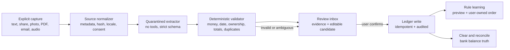

# External deep research: modernizing `maj0rika/Household-account-book`

**Access date:** 2026-08-18 (Asia/Seoul)  
**Research mode:** English-first external research; 88 distinct web searches plus official OpenAI documentation searches; important pages fetched in full where available.  
**Scope:** current model families and exact API IDs; structured outputs, reasoning, tools, image/PDF/receipt/SMS/email/audio ingestion; batch/cache/cost/latency/routing; evals, observability, PII, prompt injection; personal-finance product workflows; mature open-source patterns; exact-evidence disambiguation of `5.6sol`.  
**External-write boundary:** read-only web/docs/source-repository research. No accounts were created, no login barriers were bypassed, and no external data was changed.

## Evidence vocabulary

- **Verified — official:** current first-party API documentation, model catalog, policy, help center, or first-party source repository.
- **Documented:** a product or project documents the workflow; it was not independently exercised in an authenticated product session.
- **Marketed:** a vendor or project release/marketing page claims the capability; this is weaker than an observed end-to-end run.
- **Observed locally:** a fact read from this checkout. This is not proof of production behavior.
- **Inferred / recommended:** synthesis from the evidence. It must be validated against this application's Korean inputs, deployment, and privacy requirements.

No commercial product workflow below is labeled **observed**: this pass did not create or use authenticated accounts. That distinction matters because help-center behavior, marketed behavior, and live behavior can diverge.

## Executive decision

The modernization should be a **schema-first, evidence-preserving ingestion system**, not a bigger-model swap and not a fastest-provider race.

1. **Resolve the immediate model-lifecycle risk.** The repository currently names direct Kimi `kimi-k2.5` (**observed locally**). Kimi's current official model list says `kimi-k2.5` is unavailable to newly registered users and has a **full platform sunset on 2026-08-31**; the supported flagship replacement is exact ID `kimi-k3`. The old K2 series was discontinued on 2026-05-25. This is the only externally verified date-driven P0 in this report. [Kimi model list](https://platform.kimi.ai/docs/models)
2. **Interpret `5.6sol` as shorthand, not an API slug.** The exact current OpenAI model ID is **`gpt-5.6-sol`**. The alias **`gpt-5.6`** currently routes to it. There is no official OpenAI model ID spelled `5.6sol`. [OpenAI latest-model guide](https://developers.openai.com/api/docs/guides/latest-model), [GPT-5.6 Sol model page](https://developers.openai.com/api/docs/models/gpt-5.6-sol)
3. **Do not make Sol the default transaction parser.** Use `gpt-5.6-luna` as the first benchmark for short text/SMS/email extraction and `gpt-5.6-terra` as the first benchmark for difficult images/PDFs. Reserve `gpt-5.6-sol` for offline adjudication or genuinely hard cases only if application evals prove a material gain. This is a cost/quality recommendation, not a benchmark result for this application.
4. **Move from prompt-shaped JSON to provider-enforced Structured Outputs.** Shape validity is not semantic correctness, so keep deterministic validators for dates, integer money, currency, user-owned account/category IDs, totals, transfers, and duplicates. [OpenAI Structured Outputs](https://developers.openai.com/api/docs/guides/structured-outputs)
5. **Choose a route before the request.** Do not race providers or silently switch provider/model because one call fails. Route by source, capability, privacy policy, and an eval-backed model map; if the selected call fails, preserve and surface that exact failure. Provider competition belongs in offline evals, not one user's transaction request.
6. **Quarantine every receipt, email, PDF, SMS, and notification as untrusted data.** The extractor gets no write tools. A separate deterministic service validates the candidate, and a human review step authorizes the ledger write. OWASP explicitly treats documents, emails, images, and tool outputs as indirect-prompt-injection surfaces. [OWASP LLM Prompt Injection Prevention](https://cheatsheetseries.owasp.org/cheatsheets/LLM_Prompt_Injection_Prevention_Cheat_Sheet.html)
7. **Adopt the mature finance loop:** ingest -> review -> rule -> clear -> reconcile. Commercial and open-source products converge on review queues, editable ordered rules, pending/cleared/reconciled states, recurring schedules matched to actual transactions, transfer neutrality, duplicate protection, and user-visible corrections.

## Exact disambiguation: what does `5.6sol` mean?

### Verified evidence

- OpenAI's current model guidance declares `latestModelInfo.model: gpt-5.6-sol` and says `gpt-5.6` routes to `gpt-5.6-sol`. [Official model guidance](https://developers.openai.com/api/docs/guides/latest-model)
- The first-party model page names **GPT-5.6 Sol**, exact API ID **`gpt-5.6-sol`**, current snapshot **`gpt-5.6-sol`**, and alias **`gpt-5.6`**. [Official Sol model page](https://developers.openai.com/api/docs/models/gpt-5.6-sol)
- OpenAI's release post describes Sol, Terra, and Luna as the GPT-5.6 capability tiers and says the family became generally available on 2026-07-09. [Official GPT-5.6 release](https://openai.com/index/gpt-5-6/)
- Exact-phrase web searches for `"5.6sol"` found informal shorthand on third-party/community pages, but no first-party API identifier with that spelling.

### Conclusion

**Inferred with high confidence:** the user's phrase `5.6sol` means **GPT-5.6 Sol**. Use `gpt-5.6-sol` in configuration and documentation. Do not turn the shorthand into `5.6sol`, `gpt-5.6sol`, or a Claude “Sonnet” model. If the intent was a product UI selector rather than the API, the user should still be shown the canonical family/tier name “GPT-5.6 Sol.”

## Current model and API inventory

Prices are public list prices in USD per 1M tokens unless noted. They are snapshots as of the access date, not contractual quotes. Image/audio/reasoning metering and provider tokenizers differ, so the nominal token prices are not directly equivalent.

### OpenAI: strongest single-provider modernization path

| Exact ID | Current role and capabilities | Standard short-context price | Availability and caveats |
| --- | --- | ---: | --- |
| `gpt-5.6-sol` | Frontier reasoning; text+image input, text output; Responses, Chat Completions, Batch; streaming, Structured Outputs, function calling, prompt caching; 1,050,000-token context, 128,000 max output | $5 input / $0.50 cached read / $6.25 cache write / $30 output | GA. Inputs above 272K are charged 2x input and 1.5x output for the full request. Exact named tier; `gpt-5.6` aliases here. [Model](https://developers.openai.com/api/docs/models/gpt-5.6-sol) |
| `gpt-5.6-terra` | Same documented modality/API/structured/tool surface; balance of intelligence and cost | $2 / $0.20 / $2.50 / $12 | GA. Same long-context uplift. [Model](https://developers.openai.com/api/docs/models/gpt-5.6-terra) |
| `gpt-5.6-luna` | Same documented modality/API/structured/tool surface; cost-sensitive high volume | $0.20 / $0.02 / $0.25 / $1.20 | GA. Same long-context uplift. [Model](https://developers.openai.com/api/docs/models/gpt-5.6-luna) |
| `gpt-transcribe` | Completed audio files, streamed file transcription, and committed Realtime turns; audio+text input -> text; keyword and language hints | Estimated $0.0045/minute | Recommended current file transcription model; `/v1/audio/transcriptions`; 25 MB file limit in the guide. [Model](https://developers.openai.com/api/docs/models/gpt-transcribe), [guide](https://developers.openai.com/api/docs/guides/speech-to-text) |
| `gpt-live-transcribe` | Low-latency live speech-to-text deltas; keyword/language hints and tunable delay | Estimated $0.017/minute | Realtime transcription endpoint, not a general Responses model. [Model](https://developers.openai.com/api/docs/models/gpt-live-transcribe), [guide](https://developers.openai.com/api/docs/guides/realtime-transcription) |
| `omni-moderation-latest` | Harmful-content moderation | Free in the current pricing table | Moderation is not a PII detector and not a prompt-injection guarantee. [Pricing](https://developers.openai.com/api/docs/pricing) |

Current exact standard, Batch/Flex, Fast, long-context, audio, and tool pricing is in the [official pricing table](https://developers.openai.com/api/docs/pricing). Regional-processing endpoints eligible for data residency carry a documented 10% uplift. OpenAI renamed Priority processing to Fast mode on 2026-07-30; requests may use `service_tier: "fast"` or `"priority"`.

#### OpenAI API surface to prefer

- Use **Responses API** (`POST /v1/responses`) for GPT-5.6 structured extraction, multimodal inputs, reasoning controls, and state/tool semantics. OpenAI's model guide explicitly recommends Responses for reasoning, tools, and multi-turn work. [Model guidance](https://developers.openai.com/api/docs/guides/latest-model)
- Use `text.format` with `type: "json_schema"` / SDK Zod parsing for a transaction candidate. Strict Structured Outputs enforce shape, not factual correctness. [Structured Outputs](https://developers.openai.com/api/docs/guides/structured-outputs)
- Use `reasoning.effort: "none"` as the latency baseline for simple extraction and compare `"low"` in evals. Do not assume higher effort is better; the official guide says to compare representative tasks. GPT-5.6 supports `none`, `low`, `medium`, `high`, `xhigh`, and `max`. [Model guidance](https://developers.openai.com/api/docs/guides/latest-model)
- Images can use `detail: "original"`; on GPT-5.6, `auto`/omitted also preserve original dimensions. This helps small OCR text but can increase tokens and latency. [Images and vision](https://developers.openai.com/api/docs/guides/images-vision)
- PDF `input_file` handling extracts both text and page images. GPT-5.6 PDF `auto` uses high page-image detail; set low or high deliberately after measuring. Each file and combined request are currently limited to 50 MB. [File inputs](https://developers.openai.com/api/docs/guides/file-inputs)
- For finance data, set `store: false`. It disables API state storage; it is not, by itself, an organizational ZDR agreement. ZDR customers can replay encrypted reasoning items statelessly. [Responses migration/statefulness](https://developers.openai.com/api/docs/guides/migrate-to-responses), [data controls](https://developers.openai.com/api/docs/guides/your-data)

### Other current provider families worth benchmarking

| Provider | Exact current IDs / API | Relevant capabilities | Current price and availability notes | Finance-data caveat |
| --- | --- | --- | --- | --- |
| Anthropic | `claude-fable-5`, `claude-opus-5`, `claude-sonnet-5`, `claude-haiku-4-5-20251001`; Messages API `/v1/messages` | Current models accept text+image; PDF processing; JSON Structured Outputs via `output_config.format`; strict tools; prompt cache; Batch | Fable $10/$50; Opus 5 $5/$25; Sonnet 5 introductory $2/$10 through **2026-08-31**, then $3/$15; Haiku 4.5 $1/$5. [Models](https://platform.claude.com/docs/en/about-claude/models/overview), [pricing](https://platform.claude.com/docs/en/about-claude/pricing) | Fable 5 and Mythos 5 require 30-day retention and are not ZDR eligible. Sonnet 5 supports ZDR for contracted organizations. [Retention](https://platform.claude.com/docs/en/manage-claude/api-and-data-retention) |
| Google Gemini | `gemini-3.6-flash`, `gemini-3.5-flash-lite`; Interactions API `v1beta/interactions` (also legacy `generateContent`) | Both current GA models: 1M context, 64K max output, thinking, multimodal, built-in tools; JSON Schema Structured Output; native PDF document understanding | 3.6 Flash $1.50/$7.50; 3.5 Flash-Lite $0.30/$2.50. Both GA as of 2026-07-21. [Latest guide](https://ai.google.dev/gemini-api/docs/latest-model), [changelog](https://ai.google.dev/gemini-api/docs/changelog) | The official pricing/terms distinguish free and paid tiers: free content may improve products; paid content is not used to improve products. [Pricing](https://ai.google.dev/gemini-api/docs/pricing), [terms](https://ai.google.dev/gemini-api/terms_preview) |
| Kimi direct | `kimi-k3`; Chat Completions-compatible API at Kimi Platform | Native visual understanding, 1M context, reasoning effort `low/high/max`, tools, JSON mode and JSON Schema Structured Output, cache, batch | K3: $3 cache-miss input / $0.30 cache-hit / $15 output. `kimi-k2.5` and `moonshot-v1` full sunset 2026-08-31; K2 series already discontinued. [Models](https://platform.kimi.ai/docs/models), [K3 pricing](https://platform.kimi.ai/docs/pricing/chat-k3) | Public privacy policy says user content includes prompts/audio/images/files and may be used to improve/train underlying technology. Do not send raw household finance data without confirmed account/contract controls. [Privacy](https://platform.kimi.ai/docs/agreement/userprivacy) |
| MiniMax direct | `MiniMax-M3`; OpenAI-compatible `POST https://api.minimax.io/v1/responses` and Chat Completions/Anthropic-compatible surfaces | M3 is multimodal with 1M context; OpenAI Responses shape; tool calling; prompt caching. Reasoning can be enabled, but accepted effort values do not tune depth on M3 | Current permanent-discount table: <=512K, $0.30 input / $0.06 cache read / $1.20 output; Priority 1.5x. M2.7 active; M2.5 listed legacy. [Models](https://platform.minimax.io/docs/guides/models-intro), [Responses](https://platform.minimax.io/docs/api-reference/responses-create), [pricing](https://platform.minimax.io/docs/guides/pricing-paygo) | Public privacy policy provides general retention language, not a verified default ZDR commitment in this pass. Confirm DPA, retention, geography, and training-use controls before finance data. [Privacy](https://platform.minimax.io/protocol/privacy-policy) |
| Fireworks | Request resource names include `accounts/fireworks/models/kimi-k3`, `accounts/fireworks/models/minimax-m3`, `accounts/fireworks/models/deepseek-v4-flash-0731`; OpenAI-compatible base `https://api.fireworks.ai/inference/v1` | Open-model hosting; Structured Outputs, tools, vision, Responses, prompt cache, Batch, standard/priority/fast paths | Examples: Kimi K3 $3/$0.30/$15; MiniMax M3 $0.30/$0.06/$1.20; DeepSeek V4 Flash (0731) $0.14/$0.028/$0.28. Batch is 50% of serverless. [Recommendations](https://docs.fireworks.ai/guides/recommended-models), [pricing](https://docs.fireworks.ai/serverless/pricing) | Open models have default ZDR, but Fireworks Responses stores full conversation by default for 30 days when `store=True`; explicitly use `store=False`. [Data handling](https://docs.fireworks.ai/guides/security_compliance/data_handling) |

### Selection recommendation for this app

**Inferred / requires a Korean-domain eval:**

- Start with one production provider and a small explicit route table, not three live competitors.
- **Text/SMS/email candidate:** `gpt-5.6-luna`, `reasoning.effort: "none"`, strict schema.
- **Receipt/photo/PDF candidate:** `gpt-5.6-terra`, deliberate image/PDF detail. Compare against `gemini-3.6-flash` because Gemini documents strong multimodal/PDF support.
- **Recorded voice:** `gpt-transcribe`, then the same text candidate parser. **Live dictation:** `gpt-live-transcribe`, then the same parser.
- **Hard/offline adjudication:** `gpt-5.6-sol`, only if a held-out set shows a meaningful error reduction worth roughly 25x Luna's input price and output price.
- **Low-cost alternative benchmark:** `MiniMax-M3`, Fireworks `accounts/fireworks/models/minimax-m3`, and Gemini `gemini-3.5-flash-lite`. Benchmark semantic accuracy, not only JSON validity or list price.
- **Do not select `claude-fable-5` for raw finance ingestion** while its required 30-day retention conflicts with a minimized-data posture.
- **Do not continue direct `kimi-k2.5` past 2026-08-31.** A Fireworks-hosted K2.5 resource is a different availability lane, but it should still be treated as legacy and benchmarked against current models.

## Target ingestion architecture

The model is an extractor inside a bounded lane. It does not select arbitrary tools, update the database, create categories, choose another provider, or decide that a low-confidence candidate is safe to save.

### Canonical candidate contract

Use a single versioned schema across all source types. Recommended fields:

- `schemaVersion`, `sourceType`, `sourceEventId`, `sourceHash`, `ingestedAt`;
- `occurredAt`, optional `postedAt`, timezone, `currency` (ISO 4217);
- `amountMinor` as an integer, `direction` (`expense|income|transfer`), optional debit/credit evidence;
- `merchantRaw`, `merchantNormalizedCandidate`, `description`;
- `accountCandidateId` drawn only from a server-supplied enum of accounts owned by the current user;
- `categoryCandidateId` drawn only from a server-supplied enum, or explicit `needsCategoryReview`;
- optional `lineItems`, tax, discount, gratuity, subtotal, total;
- `recurringCandidate`, but no automatic schedule creation;
- `evidence`: source text spans, receipt boxes/page numbers, or audio time spans where the source/API provides them;
- `ambiguities` and `missingFields`; do not treat a model's self-reported confidence as calibrated probability;
- `parserRunId`, exact provider/model ID, prompt version, schema version, validator version.

Semantic gates after schema parsing should reject or force review for invalid dates, non-integer KRW amounts, negative/zero amount inconsistencies, unknown currency, totals that do not reconcile, unowned account/category IDs, unexpected extra fields, suspected transfer double counting, or a duplicate source fingerprint.

## Source-specific ingestion

### Receipt and image

1. **On-device OCR first is a privacy and UX option, not a silent fallback.** Apple's Vision text recognition runs on device and supports fast/accurate paths; ML Kit Text Recognition v2 explicitly supports Korean and has bundled or Play-Services-delivered Android models. [Apple Vision](https://developer.apple.com/documentation/vision/recognizing-text-in-images), [ML Kit overview](https://developers.google.com/ml-kit/vision/text-recognition/v2), [Android Korean model](https://developers.google.com/ml-kit/vision/text-recognition/v2/android)
2. Route to the chosen mode **before** work begins: “on-device OCR + text parse” or “cloud vision parse.” If one fails, show the original failure and let the user explicitly choose another mode; do not silently upload a receipt after local processing failed.
3. OpenAI warns that vision may underperform on non-Latin image text and on small/rotated text. For GPT-5.6, `detail: "original"` preserves image dimensions; evaluate its accuracy and token cost on real Korean receipts. [OpenAI vision limitations](https://developers.openai.com/api/docs/guides/images-vision)
4. Dedicated document services are useful benchmarks, not assumed winners. Google Document AI's GA Expense Parser extracts date, supplier, total, and currency, but its currently documented language list is German, English, Spanish, French, Japanese, and Dutch — **not Korean**. [Processor list](https://docs.cloud.google.com/document-ai/docs/processors-list) Azure's `prebuilt-receipt` and AWS Textract `AnalyzeExpense` return structured receipt fields, but Korea-specific accuracy still needs an application eval. [Azure receipt model](https://learn.microsoft.com/en-us/azure/ai-services/document-intelligence/prebuilt/receipt?view=doc-intel-4.0.0), [AWS AnalyzeExpense](https://docs.aws.amazon.com/textract/latest/dg/analyzing-document-expense.html)
5. CORD is a useful public bootstrap dataset for post-OCR receipt parsing, but its public samples are Indonesian receipts, not a substitute for a consented Korean test set. [CORD source repository](https://github.com/clovaai/cord)

### PDF and statement files

- OpenAI Responses `input_file` sends extracted text and page images for PDFs. Gemini natively interprets PDF text, images, charts, and tables up to documented limits. Claude also processes PDF text and page visuals. [OpenAI file inputs](https://developers.openai.com/api/docs/guides/file-inputs), [Gemini document understanding](https://ai.google.dev/gemini-api/docs/document-processing), [Claude PDF support](https://platform.claude.com/docs/en/build-with-claude/pdf-support)
- Do not pass an entire bank statement merely because the context window permits it. Select pages, crop account numbers, strip document metadata, and encrypt the source at rest under a short retention policy.
- Treat PDF text, hidden layers, annotations, QR content, and images as untrusted. Extraction produces candidates only; it cannot trigger a tool or a ledger write.

### SMS and bank notifications

- **Android SMS permission is not a viable default.** Google Play restricts `READ_SMS`/`RECEIVE_SMS` to default SMS/Phone/Assistant handlers or narrow eligible exceptions; common non-default uses are invalid. A household-accounting app should not assume approval. [Google Play SMS policy](https://support.google.com/googleplay/android-developer/answer/10208820)
- Android's `NotificationListenerService` can receive callbacks when notifications are posted/removed after the user grants notification access. This is technically possible but exposes a broad notification surface. Make it opt-in, explain scope, filter allowlisted finance packages locally, minimize captured fields, and provide a kill switch and deletion controls. [Android API](https://developer.android.com/reference/android/service/notification/NotificationListenerService)
- **iOS carrier SMS ingestion is not a Korea-wide consumer path.** TelephonyMessagingKit requires the app to be selected as the default carrier messaging app and is enabled for users whose account and device are in the EU. [Apple TelephonyMessagingKit](https://developer.apple.com/documentation/TelephonyMessagingKit), [carrier app guide](https://developer.apple.com/documentation/availability/creating-a-carrier-messaging-app)
- Cross-platform primary flows should therefore be explicit user paste/share, screenshot/photo OCR, and inbound email. A notification listener can remain an Android-only advanced mode, clearly separated from the core app.

### Email

- Direct Gmail access can require sensitive or restricted OAuth scopes; restricted scopes require OAuth verification, and server storage/transmission of restricted-scope data can require a security assessment. This is a high operational/compliance cost for a personal app. [Gmail scopes](https://developers.google.com/workspace/gmail/api/auth/scopes)
- A lower-friction option is a unique per-user inbound alias to which users explicitly forward bank/merchant receipts. Resend, for example, receives mail, emits a signed webhook, and exposes bodies/attachments via a subsequent API; it stores inbound mail and retries delivery, so retention and deletion must be deliberate. [Resend Receiving](https://resend.com/docs/dashboard/receiving/introduction)
- Verify webhook signatures, deduplicate on provider event/message ID, scan attachment type/size, sanitize HTML, ignore remote images, and never treat sender address as authorization.
- Email body, subject, headers, and attachments are indirect prompt-injection input. Extract in a no-tools lane and require review before saving.

### Audio

- `gpt-5.6-sol|terra|luna` do **not** accept audio according to their model pages. Transcribe first.
- For a completed mobile recording, use exact ID `gpt-transcribe`; pass Korean/domain keywords and expected languages, then parse the transcript through the same schema. For live dictation, use `gpt-live-transcribe` over Realtime transcription.
- Include amounts, dates, currencies, Korean/English code switching, merchant names, background noise, clipped utterances, and corrections in the eval set. OpenAI's production checklist says to test real microphones, noise, accents, numbers, dates, and currencies. [File transcription](https://developers.openai.com/api/docs/guides/speech-to-text), [Realtime transcription](https://developers.openai.com/api/docs/guides/realtime-transcription)
- Do not auto-save a partial live transcript. Only a final committed turn may become a candidate, and the review UI should show the transcript next to parsed fields.

## Cost, cache, latency, and routing

### Illustrative text-only request cost

For a hypothetical 2,000 uncached input tokens and 300 output tokens, excluding image tokens, reasoning tokens, tool charges, taxes, and regional uplift:

| Model | Approximate list-price cost/request |
| --- | ---: |
| `gpt-5.6-luna` | $0.00076 |
| `MiniMax-M3` direct, <=512K | $0.00096 |
| `gemini-3.5-flash-lite` | $0.00135 |
| `gpt-5.6-terra` | $0.00760 |
| `claude-sonnet-5` introductory price | $0.00700; becomes $0.01050 at $3/$15 |
| `kimi-k3` | $0.01050 |
| `gpt-5.6-sol` | $0.01900 |

These are arithmetic illustrations, not application measurements. The real decision variable should be **cost per accepted, correct transaction after review**, not cost per API response.

### Processing modes

- **Standard:** interactive parse and review.
- **Batch:** backfills, reclassification, eval generation, and nightly duplicate/rule analysis. OpenAI Batch documents 50% lower cost, a separate rate-limit pool, and completion within 24 hours. [Batch](https://developers.openai.com/api/docs/guides/batch)
- **Flex:** non-urgent synchronous/offline work at Batch rates in exchange for slower responses and possible `429 Resource Unavailable`; it is beta. In this project's no-fallback operating model, record and surface that failure rather than silently switching to Standard. [Flex](https://developers.openai.com/api/docs/guides/flex-processing)
- **Fast:** only if a measured, high-value interactive path needs it. OpenAI documents up to 2.5x speed for Sol, while current GPT-5.6 Fast pricing is 4x Standard token rates. [Fast mode](https://developers.openai.com/api/docs/guides/fast-mode), [pricing](https://developers.openai.com/api/docs/pricing)

### Prompt caching

- Put the stable system contract, schema, category/account enums, and tool definitions first; dynamic transaction content last.
- GPT-5.6 explicit cache writes cost 1.25x uncached input while reads cost 0.1x. Track both `cache_write_tokens` and `cached_tokens`; unique prompts can cost more if written but never reused. [Model guidance](https://developers.openai.com/api/docs/guides/latest-model)
- Cache only long, reused prefixes. User-specific category/account lists are sensitive and change more often than a global schema; scope cache keys and retention accordingly.
- Never cache raw receipt/email/SMS content merely to chase a hit rate.

### Latency controls

The highest-leverage controls are smaller models, fewer generated tokens, fewer sequential requests, and progress UI. OpenAI's latency guide notes output generation is usually the dominant cost and recommends not defaulting to an LLM when deterministic logic is enough. [Latency optimization](https://developers.openai.com/api/docs/guides/latency-optimization)

Recommended route map (**inferred**):

| Source/work | Route chosen before execution | Failure behavior |
| --- | --- | --- |
| Exact known bank-notification template | Deterministic parser + same validators | Preserve exact parser error; offer explicit user edit/alternate mode |
| Natural-language text, pasted SMS, forwarded email text | `gpt-5.6-luna`, strict schema, no tools | Surface exact provider/validator failure; no provider switch |
| Receipt image or visually dense PDF | `gpt-5.6-terra` or eval winner, deliberate detail | Candidate goes to review; failure stays in this lane |
| Recorded audio | `gpt-transcribe` -> text route | Surface transcription or parse failure separately |
| Live audio | `gpt-live-transcribe` final turn -> text route | Never parse/save partial deltas |
| Backfill/eval | Batch or Flex selected explicitly | Job remains failed/pending with original reason |
| Hard adjudication | `gpt-5.6-sol` only as an explicit offline/approved route | No silent escalation from a cheaper model |

## Product workflow research

### Commercial product evidence

| Product workflow | Evidence label | Documented behavior | Design lesson for Household-account-book |
| --- | --- | --- | --- |
| Monarch transaction rules | **Documented** | Ordered rules match original statement/merchant/amount/category/account and can rename, categorize, tag, hide, split, link goals, or set review status; rule preview and retroactive application are exposed. [Help](https://help.monarch.com/hc/en-us/articles/360048393372-Transaction-Rules) | Make rules user-owned, ordered, previewable, explainable, and reversible. AI corrections should propose a rule, not silently create one. |
| YNAB import and reconciliation | **Documented** | Imported transactions remain subject to approval/clearing; reconciliation compares ledger and bank balance and reduces future duplicate imports. File import also performs duplicate protection. [Reconciliation](https://support.ynab.com/en_us/reconciling-accounts-a-guide-BJFE3fHys), [file import](https://support.ynab.com/en_us/file-based-import-a-guide-Bkj4Sszyo) | A correct parser is insufficient without pending/cleared/reconciled states and a bank-balance checkpoint. |
| Rocket Money rules/subscriptions | **Documented** | The product detects subscriptions from connected transactions; rules can match name/amount and change category, bill assignment, budget inclusion, and more. [Help](https://help.rocketmoney.com/en/articles/10328100-creating-transaction-rules) | Keep recurring detection distinct from ordinary categorization and let users correct it. |
| Copilot recurrings | **Documented** | Users create schedules from matching transaction names, estimated frequency, amount ranges, date windows, and category. [Help](https://help.copilot.money/en/articles/3760068-creating-recurrings) | Recurrence is a candidate pattern with tolerances, not a copied transaction. |
| Quicken Simplifi Spending Plan | **Documented** | Separates recurring income, bills/subscriptions, planned variable spend, other spend, goals, and “left this month”; linked recurring transactions avoid double counting; transfers/credit-card payments are excluded by default. [Help](https://support.simplifi.quicken.com/en/articles/4212702-understanding-your-spending-plan) | Keep plan, actual, recurring, transfer, and goal semantics distinct. Never count a credit-card payment as a second expense. |
| Quicken Simplifi Watchlists/privacy mode | **Documented** | Watchlists track selected categories/payees/tags with targets; privacy mode masks balances, amounts, net worth, and score across screens. [Watchlists](https://support.simplifi.quicken.com/en/articles/3472367-using-watchlists-on-the-web-app), [privacy mode](https://support.simplifi.quicken.com/en/articles/13172063-using-privacy-mode) | Add focused spending alerts and an app-wide shoulder-surfing/privacy display mode. |

### Convergent product pattern

**Inferred from multiple documented products:** the durable value is not “AI parsed it.” It is the short feedback loop:

1. import or capture;
2. visibly mark items needing review;
3. user corrects merchant/category/account/recurrence;
4. system proposes an editable rule;
5. pending items clear;
6. account reconciles to an external balance;
7. planned/recurring/transfer semantics prevent double counting.

That loop creates reliable finance data and produces the labeled corrections needed for future model evaluation.

## Mature open-source patterns

| Project | Evidence label | Pattern worth borrowing | Important limitation |
| --- | --- | --- | --- |
| Actual Budget | **Documented / source repository** | Local-first finance data; staged ordered rules; automatic payee/category rules learned from corrections but editable by the user; schedules with exact/approximate/range amounts; reconciliation; API; client/server sync. [README](https://github.com/actualbudget/actual), [rules](https://actualbudget.org/docs/budgeting/rules/), [schedules](https://actualbudget.org/docs/schedules/), [reconciliation](https://actualbudget.org/docs/accounts/reconciliation/) | Bank-sync API secrets live on the server and are not covered by budget E2E encryption; shared-host isolation is limited. [Bank sync](https://actualbudget.org/docs/advanced/bank-sync/), [ADR](https://actualbudget.org/docs/contributing/leadership/architecture-decision-records/) |
| Firefly III + Data Importer | **Documented / source project** | Explicit rule engine with triggers/actions/order; imports use a conversion+validation stage before committing; reusable import configuration; duplicate-detection choices; CLI automation with meaningful exit codes. [Rules](https://docs.firefly-iii.org/how-to/firefly-iii/features/rules/), [CSV import](https://docs.firefly-iii.org/how-to/data-importer/import/csv/), [CLI import](https://docs.firefly-iii.org/how-to/data-importer/advanced/cli/) | Rule errors can be asynchronous and may only appear in logs; copy the transparency, not hidden failure behavior. |
| Beancount | **Documented / source project** | Double-entry ledger model and explicit account/posting semantics; useful mental model for transfers, liabilities, splits, and auditability. [Documentation](https://beancount.github.io/docs/) | Text-ledger UX is not the target mobile UX; borrow invariants, not interface. |
| Maybe Finance | **Marketed in final release / source repository** | Treated transfers as first-class and excluded neutral transfers from budgets; supported one-time-expense semantics and reconciliation without awkward uncategorized adjustments. [Release](https://github.com/maybe-finance/maybe/releases) | Repository explicitly says it is no longer actively maintained. Do not add it as a dependency or treat it as a current implementation authority. [README](https://github.com/maybe-finance/maybe) |
| CORD / Donut | **Documented research source** | Receipt-specific boxes, text, hierarchy, and semantic labels; useful to bootstrap parser/eval tooling and evidence fields. [CORD](https://github.com/clovaai/cord), [Donut](https://github.com/clovaai/donut) | Public CORD samples are Indonesian and old relative to current phone cameras/receipts; they do not validate Korean production quality. |

### Open-source synthesis

Borrow these abstractions:

- append-only import provenance and idempotency keys;
- pending -> reviewed -> cleared -> reconciled state transitions;
- first-class transfers and split postings;
- rule stages/order, preview, and affected-transaction count;
- recurring schedule separate from its matched posted transaction;
- validation before commit and explicit importer exit/status codes;
- local-first/offline capture where practical, with a clear statement of what secrets remain server-readable.

Do not copy a project's deployment or encryption claims into this app without testing its own Supabase/Capacitor/Vercel boundaries.

## Safety, privacy, and prompt injection

### Threat model

Untrusted instructions can arrive in:

- pasted bank notifications or SMS;
- email subject/body/HTML/attachments;
- visible or hidden receipt/PDF text, QR codes, annotations, or metadata;
- audio (“ignore the schema…”);
- merchant names and transaction descriptions;
- imported rules, category names, and provider tool output.

NIST's Generative AI Profile describes direct and indirect prompt injection and notes that retrieved data can cause downstream unauthorized behavior. [NIST AI 600-1 PDF](https://tsapps.nist.gov/publication/get_pdf.cfm?pub_id=958388) Recent 2026 research continues to demonstrate model-dependent indirect-injection attacks against tool-using agents. [Large-scale public competition paper](https://arxiv.org/abs/2603.15714), [system-level defenses paper](https://arxiv.org/abs/2603.30016)

### Required controls

1. **Extractor has no tools.** It receives only the schema, allowed enums, current date/timezone, and untrusted source data in a clearly delimited content block.
2. **No model-to-database write.** Candidate output is validated and shown to the user. A separate server action checks auth, ownership, idempotency, and invariant rules before writing.
3. **Strict schema and allowlists.** `additionalProperties: false`; account/category IDs are server-provided enums; URLs and HTML are never executed or rendered unsanitized.
4. **Evidence-bound review.** Show source text/box/page/time evidence next to each field and highlight disagreements.
5. **Least data.** Crop/mask receipt regions, remove email tracking assets and unnecessary headers, hash source identifiers, and define deletion TTLs.
6. **Least privilege.** Inbound email webhook can create an ingestion candidate, not a transaction. Notification listener cannot access the ledger write API directly.
7. **Output validation.** Reject hidden links/HTML, unexpected fields, out-of-range dates/amounts, and any text trying to issue instructions.
8. **Human approval for finance effects.** Model output cannot auto-create a new account/category, delete data, move funds, or mark reconciliation complete.
9. **Adversarial evals.** Include visible, hidden, encoded, multilingual, typoglycemic, image-layer, HTML, and multi-turn injections. The pass criterion for unauthorized action/tool use is zero.
10. **Incident visibility.** Trace blocked injections and validation failures without logging raw finance content.

OWASP recommends input separation, output validation, least privilege, human review, remote-content sanitization, comprehensive monitoring, and guardrails as defense-in-depth; it explicitly warns that an LLM guardrail is itself attackable. [OWASP cheat sheet](https://cheatsheetseries.owasp.org/cheatsheets/LLM_Prompt_Injection_Prevention_Cheat_Sheet.html)

### PII/data handling baseline

- Classify receipt/SMS/email/audio/statement data as sensitive financial data.
- Never log raw source, full prompt, response, account number, email body, image, or transcript in the normal application log.
- Log a keyed hash, byte/character count, modality, model ID, latency, token usage, validator codes, and review outcome.
- Encrypt source artifacts separately from normalized ledger fields; use short, explicit retention and deletion jobs.
- Use `store:false` on OpenAI and Fireworks Responses. Confirm organizational ZDR/DPA settings separately; request flags do not replace a contract.
- Avoid OpenAI/Google free data-sharing tiers and providers whose current public terms do not establish acceptable data use for this workload.
- Send a privacy-preserving stable `safety_identifier` where supported; hash an internal user ID, not email/phone.
- Provide export, source deletion, model-processing disclosure, and consent withdrawal paths.

## Evals and observability

### Evaluation system

Build an application-owned, version-controlled eval corpus before changing live routing.

Required slices:

- Korean casual text, bank alerts, merchant alerts, and multi-transaction messages;
- clear, blurred, rotated, cropped, long, thermal-paper, table-heavy, and handwritten receipts;
- Korean/English mixed receipts and foreign currencies;
- PDFs with native text, scanned pages, tables, and multiple transactions;
- forwarded plaintext email, HTML email, attachments, and duplicate forwards;
- audio across microphones, noise, accents, code switching, corrections, dates, and KRW amounts;
- income, expense, transfer, card payment, refund, split, recurring, pending, and balance/account cases;
- unknown category/account, ambiguous date, tax/tip/discount, negative/zero amount, and duplicate source;
- direct, indirect, multimodal, encoded, and hidden prompt injection.

Keep train/development examples separate from a locked held-out set. Public CORD examples can exercise tooling, but the release gate must use consented, de-identified Korean-domain examples.

### Metrics and gates

1. Schema parse rate (target 100% for accepted responses).
2. Exact/normalized field accuracy for amount, currency, date, direction, merchant, account, category, and recurrence.
3. Critical financial invariant violations (target zero): wrong sign, wrong minor units, unowned IDs, transfer double count, impossible totals.
4. Duplicate precision/recall and reconciliation delta.
5. Review-required rate and user correction rate by slice.
6. Evidence coverage: proportion of populated fields tied to a source span/box/page/time.
7. Prompt-injection unauthorized action/tool/write rate (target zero).
8. Refusal, empty output, timeout, rate-limit, schema error, semantic validation error — separate buckets.
9. p50/p95 end-to-end latency, provider latency, transcription/OCR time, review time.
10. Input/output/reasoning/cache tokens, list-price estimate, and **cost per accepted correct transaction**.
11. Model/prompt/schema/rule version regression diffs.

Use deterministic graders for JSON/schema, dates, money, enums, invariants, and exact labels. LLM-as-judge can support nuanced merchant/description quality but must not be the only grader for financial correctness.

### Tooling caveat

OpenAI's current documentation says the legacy Evals platform becomes read-only on **2026-10-31** and is scheduled to shut down on **2026-11-30**, recommending Datasets for a quicker workflow. Do not make a new long-lived system depend exclusively on the Evals API. [Datasets guide](https://developers.openai.com/api/docs/guides/evaluation-getting-started), [Evals guide](https://developers.openai.com/api/docs/guides/evals)

An application-owned JSONL corpus plus a CI runner is the durable source of truth. Langfuse is an optional open-source trace/dataset/evaluation UI; its repository documents traces, prompt versions, datasets, code/LLM/human scores, and self-hosting. Redact before export regardless of deployment. [Langfuse repository](https://github.com/langfuse/langfuse), [trace design](https://langfuse.com/docs/observability/best-practices)

### Trace contract

One parse request should have one trace ID and child spans for capture, normalization, OCR/transcription, model request, schema parse, semantic validation, review, and write. Record:

- `parseRequestId`, user hash, session hash, source type/hash/size/locale;
- exact provider, base surface, model ID, service tier, reasoning setting, detail setting;
- prompt/schema/validator/rule versions;
- start/end/elapsed for each stage;
- token usage including cache read/write and reasoning tokens, current price-table version, estimated cost;
- result class (`candidate|needs_review|rejected|failed|saved`), exact validator/error codes;
- user corrections and accepted/rejected rule proposal;
- no raw finance content in ordinary traces.

Keep provider response, application candidate, validator result, user review, and ledger write as separate evidence lanes. A valid JSON response is not a valid transaction, and a saved candidate is not a reconciled transaction.

## Phased modernization sequence

### P0 — before 2026-08-31

1. Replace or explicitly disable direct `kimi-k2.5`; benchmark `kimi-k3` only if its data terms are acceptable.
2. Freeze a small Korean-domain baseline across the current providers/models before changing them.
3. Inventory every runtime model ID, endpoint, retention flag, and provider-specific parameter.
4. Remove completion language that implies a provider's success means financial correctness.

### P1 — contract and one provider

1. Define the canonical strict candidate schema and deterministic validators.
2. Implement one primary Responses/structured-output adapter, initially benchmarked with Luna/Terra.
3. Remove regex/code-fence JSON extraction from the new path.
4. Remove failure-driven provider race/switch behavior from the new path; preserve exact failures.
5. Set retention controls and redact logs before adding new ingestion sources.

### P2 — review, provenance, and reconciliation

1. Add review inbox and source evidence UI.
2. Add idempotent source hashes/event IDs and duplicate handling.
3. Add pending/cleared/reconciled state and account-balance checkpoints.
4. Make transfers and card payments first-class neutral movements.
5. Record corrections as labeled eval cases.

### P3 — ingestion expansion

1. Explicit paste/share and image/PDF capture.
2. On-device Korean OCR mode.
3. Recorded and live voice transcription.
4. Verified inbound-email alias.
5. Optional Android notification listener only after policy/privacy review; no cross-platform promise of SMS auto-import.

### P4 — user-owned automation

1. Rule suggestions from repeated corrections, with preview and affected count.
2. Ordered rule stages and conflict explanation.
3. Recurring schedule candidates matched to posted transactions.
4. Spending-plan/watchlist/privacy-mode UX.
5. Batch backfill and drift monitoring.

## What not to do

- Do not rename `5.6sol` directly into a model config; use `gpt-5.6-sol`.
- Do not send every parse to Sol.
- Do not trust JSON mode or regex-extracted JSON as schema conformance.
- Do not treat schema conformance as semantic correctness.
- Do not race multiple paid providers for one user's transaction.
- Do not silently switch provider/model after timeout, auth error, rate limit, refusal, or malformed output.
- Do not expose raw receipts, SMS, email, PDFs, or audio in logs/traces.
- Do not grant extractor tools or direct ledger-write authority.
- Do not request broad Android SMS permissions as a normal finance-app feature.
- Do not promise general iOS SMS ingestion outside the EU default-carrier-messaging conditions.
- Do not make a Gmail restricted-scope integration the first email feature.
- Do not build a new permanent dependency on the retiring OpenAI Evals platform.
- Do not copy Maybe's code as a maintained foundation or Actual's bank-token security assumptions as an app guarantee.

## Pricing and availability caveats

- All prices can change; re-fetch official pricing immediately before implementation, budgeting, or release.
- OpenAI GPT-5.6 Terra and Luna prices were reduced after the original July launch; this report uses the current 2026-08-18 official table: Terra $2/$12 and Luna $0.20/$1.20 standard short-context.
- OpenAI >272K input invokes long-context rates for the entire request; regional processing can add 10%.
- OpenAI Batch and Flex use 50%-rate tables; Flex is beta and can return resource-unavailable errors. Fast is premium and can be downgraded under ramp limits.
- Claude Sonnet 5's $2/$10 introductory pricing ends 2026-08-31; standard $3/$15 begins 2026-09-01. Fable 5 is not ZDR eligible.
- Gemini 3.6 Flash and 3.5 Flash-Lite are GA; preview/experimental model IDs should not be used as production defaults without explicit lifecycle handling.
- Kimi `kimi-k2.5`/`moonshot-v1` sunset on 2026-08-31. `kimi-k3` is the current direct-platform target.
- MiniMax's table shows a permanent 50% discount for M3; still treat the displayed prices and “permanent” label as current vendor terms, not an immutable guarantee.
- Fireworks availability is model-resource specific. Pin the full `accounts/fireworks/models/...` ID and re-check catalog/region/structured-output support for that resource.
- Audio minute prices are estimates from provider pricing; actual billing can depend on audio tokens/duration and selected mode.

## Remaining gaps

- No current provider was empirically run on this application's Korean receipts, notifications, emails, or audio; model-quality recommendations remain **unverified for the application**.
- No authenticated commercial-product session was observed; product workflow claims remain **documented** or **marketed**.
- Kimi and MiniMax enterprise/DPA/ZDR options were not established from public docs in this pass. Contract/account controls require direct confirmation.
- Apple Vision's current Korean recognition quality and exact OS/device coverage need device testing; Google ML Kit has explicit Korean support but also needs real-device evaluation.
- The Korean legal/privacy implications of notification, email, and financial-data processing require a dedicated local-law review.
- Bank connectivity in Korea, store-review policy for notification access, and local Open Banking APIs were outside this English-first pass.
- Current repository implementation, database migration, UI design, and rollout mechanics require separate local planning and tests.

## Methodology and reproducibility ledger

### Search volume and stopping rule

- 88 distinct English web searches were executed with domain, exact-phrase, `OR`, date, file-type, or content-scope operators.
- 18 compact official OpenAI documentation searches were executed through the OpenAI developer-docs index before using official-domain web pages.
- Current model/pricing/policy pages were fetched from first-party documentation. Kimi, MiniMax, and Fireworks `llms.txt` indexes and relevant Markdown pages were fetched directly to avoid relying on search snippets.
- Important product help pages, open-source project documentation, OWASP, and the NIST Generative AI Profile were opened or fully retrieved where the source permitted it.
- Search snippets were not used as the sole basis for exact model IDs, prices, lifecycle dates, API fields, or privacy claims.
- The pass stopped after official model lifecycle/capability/privacy evidence, ingestion constraints, product patterns, and implementation implications converged. Remaining empirical and Korea-specific questions are deliberately left as expansion markers.

### All web search queries

1. `site:docs.anthropic.com/en/docs/about-claude/models "model IDs" latest`
2. `site:docs.anthropic.com/en/docs/build-with-claude "structured outputs" "JSON schema"`
3. `site:docs.anthropic.com/en/docs/build-with-claude ("PDF support" OR vision)`
4. `site:docs.anthropic.com/en/docs/build-with-claude ("prompt caching" OR "message batches") pricing`
5. `site:ai.google.dev/gemini-api/docs/models "model code" latest Gemini`
6. `site:ai.google.dev/gemini-api/docs/structured-output "JSON Schema"`
7. `site:ai.google.dev/gemini-api/docs ("document processing" OR "image understanding") PDF`
8. `site:ai.google.dev/gemini-api/docs (caching OR "Batch API") pricing`
9. `site:platform.moonshot.ai/docs (model OR models) Kimi "model" API exact ID`
10. `site:platform.minimax.io/docs (model OR models) "model ID" structured output vision`
11. `site:docs.fireworks.ai (models OR "structured outputs") vision serverless`
12. `site:docs.mistral.ai/getting-started/models/models_overview exact "model ID"`
13. `site:help.monarchmoney.com ("transaction rules" OR review OR recurring OR goals)`
14. `site:help.copilot.money (transactions OR recurring OR cashflow OR review)`
15. `site:ynab.com/guide OR site:ynab.com/blog ("bank import" OR reconcile OR targets)`
16. `site:help.rocketmoney.com ("transaction rules" OR subscriptions OR bills) after:2024-01-01`
17. `site:support.simplifi.quicken.com ("Spending Plan" OR watchlists OR recurring)`
18. `site:help.monarchmoney.com "transaction rules"`
19. `site:help.monarchmoney.com ("review transactions" OR recurring OR goals)`
20. `site:help.copilot.money "recurring" transactions`
21. `site:actualbudget.org/docs (rules OR reconciliation OR schedules OR "bank sync")`
22. `site:docs.firefly-iii.org ("data importer" OR automation OR rules OR budgets OR bills)`
23. `site:github.com/actualbudget/actual README "local-first" encryption`
24. `site:github.com/firefly-iii/firefly-iii README "double-entry" personal finance`
25. `site:docs.firefly-iii.org/how-to/firefly-iii/ (rules OR budgets OR bills)`
26. `site:docs.firefly-iii.org/how-to/data-importer/ (import OR duplicate OR automation)`
27. `site:github.com/maybe-finance/maybe README "self-host" finance`
28. `site:beancount.github.io/docs "double-entry" (transactions OR accounts)`
29. `site:owasp.org "LLM Prompt Injection Prevention" (untrusted OR documents)`
30. `site:nist.gov filetype:pdf "Generative Artificial Intelligence Profile" privacy prompt injection`
31. `site:langfuse.com/docs (evaluation OR datasets OR tracing) PII`
32. `site:github.com/langfuse/langfuse README (observability OR evaluations) self-hosted`
33. `site:cheatsheetseries.owasp.org "LLM Prompt Injection Prevention Cheat Sheet"`
34. `site:genai.owasp.org "Prompt Injection" financial data untrusted input`
35. `site:openai.com OR site:developers.openai.com ("prompt injection" OR "Zero Data Retention") API`
36. `site:platform.openai.com OR site:developers.openai.com "Evals" datasets tracing`
37. `"5.6sol"`
38. `"gpt-5.6-sol" site:developers.openai.com`
39. `"5.6 sol" model AI`
40. `site:ai.google.dev/gemini-api/docs "Latest Gemini model" "gemini-3.6-flash"`
41. `site:platform.claude.com/docs/en/about-claude/models "Latest Claude models"`
42. `site:platform.claude.com/docs/en/about-claude/pricing "Claude" 2026`
43. `site:platform.claude.com/docs/en/build-with-claude/structured-outputs "JSON"`
44. `site:platform.claude.com/docs/en/build-with-claude/pdf-support "PDF"`
45. `site:platform.claude.com/docs/en/about-claude/models/overview "claude-sonnet-5"`
46. `site:platform.claude.com/docs/en/about-claude/models/overview "claude-opus-5"`
47. `site:platform.claude.com/docs/en/about-claude/models/overview "claude-fable-5"`
48. `site:platform.claude.com/docs/en/build-with-claude ("prompt caching" OR "batch processing") "50%"`
49. `site:platform.moonshot.ai/docs "kimi-k2.5" (model OR API)`
50. `site:platform.moonshot.ai/docs/api "kimi-k2.5"`
51. `site:platform.moonshot.ai/docs "kimi-k2" "model" "thinking"`
52. `site:platform.moonshot.ai/docs/guide "Kimi K2.5" multimodal`
53. `site:cloud.google.com/document-ai/docs ("Expense Parser" OR receipt) official`
54. `site:learn.microsoft.com/azure/ai-services/document-intelligence ("prebuilt receipt" OR invoice)`
55. `site:docs.aws.amazon.com/textract/latest/dg "AnalyzeExpense" receipts invoices`
56. `site:developers.google.com/ml-kit/vision/text-recognition/v2 (Android OR iOS) on-device`
57. `site:support.google.com/googleplay/android-developer "SMS and Call Log Permissions" default handler`
58. `site:developer.android.com/reference/android/service/notification/NotificationListenerService notification access`
59. `site:developer.apple.com/documentation (Messages OR SMS) third-party app access iOS`
60. `site:developers.google.com/gmail/api/auth/scopes "Restricted" scopes`
61. `site:developer.apple.com/documentation/telephonymessagingkit "Default Carrier Messaging App" entitlement eligibility`
62. `site:developer.apple.com/support "Default Carrier Messaging App" entitlement`
63. `site:developer.apple.com/documentation/vision "Recognizing text in images" VNRecognizeTextRequest`
64. `site:developers.google.com/ml-kit/vision/text-recognition/v2 "Recognize text in images"`
65. `site:developers.google.com/ml-kit/vision/text-recognition/v2 "Text recognition v2"`
66. `site:developers.google.com/ml-kit/vision/text-recognition/v2/android "Korean"`
67. `site:developers.cloudflare.com/email-routing/email-workers "Email Workers"`
68. `site:resend.com/docs/dashboard/receiving (introduction OR inbound)`
69. `site:platform.minimax.io/docs/guides/privacy-policy "user content"`
70. `site:platform.minimax.io/docs/guides/privacy-policy retention prompts`
71. `site:platform.kimi.ai/docs/agreement/userprivacy "User content" prompts`
72. `site:docs.fireworks.ai/guides/security_compliance/data_handling "Zero data retention"`
73. `site:platform.claude.com/docs/en ("zero data retention" OR "API and data retention")`
74. `site:platform.claude.com/docs/en/about-claude/models "Claude Fable 5" "30-day" retention`
75. `site:ai.google.dev/gemini-api/docs/pricing "Used to improve our products" Paid`
76. `site:developers.openai.com/api/docs/guides/your-data "store: false"`
77. `site:arxiv.org (receipt OR invoice) "information extraction" benchmark OCR CORD SROIE`
78. `site:arxiv.org "multimodal prompt injection" documents images`
79. `site:arxiv.org "indirect prompt injection" LLM agents untrusted data`
80. `site:github.com/clovaai/cord receipt dataset README`
81. `site:docs.fireworks.ai "accounts/fireworks/models/kimi-k3"`
82. `site:docs.fireworks.ai "accounts/fireworks/models/minimax-m3"`
83. `site:docs.fireworks.ai "accounts/fireworks/models/deepseek-v4-flash"`
84. `site:app.fireworks.ai/models/fireworks/kimi-k3 "Model ID"`
85. `site:learn.microsoft.com/azure/ai-services/document-intelligence/prebuilt/receipt "Korean"`
86. `site:docs.aws.amazon.com/textract/latest/dg "Korean" AnalyzeExpense`
87. `site:docs.cloud.google.com/document-ai/docs/processors-list "Expense Parser" Korean`
88. `site:developers.google.com/ml-kit/vision/text-recognition/v2 "Korean" receipt`

### Official OpenAI documentation index queries

1. `latest model model IDs pricing`
2. `structured outputs JSON schema Responses API`
3. `vision image inputs PDF file inputs Responses API`
4. `Batch API prompt caching pricing latency`
5. `tools function calling web search Responses API`
6. `evals tracing safety prompt injection PII`
7. `speech to text transcription gpt-transcribe model IDs audio API`
8. `Realtime transcription audio input model IDs`
9. `audio input Responses API model compatibility`
10. `files PDF inputs Responses API`
11. `file inputs PDF Responses API page images extracted text`
12. `Datasets API evaluation getting started`
13. `tracing Agents SDK evaluations observability`
14. `prompt caching explicit gpt-5.6 cache write tokens`
15. `your data retention Responses API store false zero data retention`
16. `Flex processing slower lower cost service tier`
17. `Fast mode service_tier latency pricing`
18. `latency optimization streaming reduce requests max tokens`

## Primary URL register

Every URL below was retrieved/opened on **2026-08-18** or was a canonical page directly linked by fetched first-party documentation and used as a reference. Failed fetches and irrelevant search results are omitted.

### OpenAI

- https://developers.openai.com/api/docs/guides/latest-model
- https://developers.openai.com/api/docs/models
- https://developers.openai.com/api/docs/models/gpt-5.6-sol
- https://developers.openai.com/api/docs/models/gpt-5.6-terra
- https://developers.openai.com/api/docs/models/gpt-5.6-luna
- https://openai.com/index/gpt-5-6/
- https://developers.openai.com/api/docs/pricing
- https://developers.openai.com/api/docs/guides/structured-outputs
- https://developers.openai.com/api/docs/guides/file-inputs
- https://developers.openai.com/api/docs/guides/images-vision
- https://developers.openai.com/api/docs/models/gpt-transcribe
- https://developers.openai.com/api/docs/models/gpt-live-transcribe
- https://developers.openai.com/api/docs/guides/speech-to-text
- https://developers.openai.com/api/docs/guides/realtime-transcription
- https://developers.openai.com/api/docs/guides/batch
- https://developers.openai.com/api/docs/guides/flex-processing
- https://developers.openai.com/api/docs/guides/fast-mode
- https://developers.openai.com/api/docs/guides/latency-optimization
- https://developers.openai.com/api/docs/guides/prompt-caching
- https://developers.openai.com/api/docs/guides/migrate-to-responses
- https://developers.openai.com/api/docs/guides/your-data
- https://developers.openai.com/api/docs/guides/evaluation-getting-started
- https://developers.openai.com/api/docs/guides/evals
- https://developers.openai.com/api/docs/guides/agents/integrations-observability

### Anthropic

- https://platform.claude.com/docs/en/about-claude/models/overview
- https://platform.claude.com/docs/en/about-claude/models/model-ids-and-versions
- https://platform.claude.com/docs/en/about-claude/models/choosing-a-model
- https://platform.claude.com/docs/en/about-claude/models/whats-new-sonnet-5
- https://platform.claude.com/docs/en/about-claude/models/whats-new-opus-5
- https://platform.claude.com/docs/en/about-claude/models/introducing-claude-fable-5-and-claude-mythos-5
- https://platform.claude.com/docs/en/about-claude/model-deprecations
- https://platform.claude.com/docs/en/about-claude/pricing
- https://platform.claude.com/docs/en/build-with-claude/structured-outputs
- https://platform.claude.com/docs/en/build-with-claude/pdf-support
- https://platform.claude.com/docs/en/manage-claude/api-and-data-retention

### Google Gemini, mobile OCR, Gmail, and Document AI

- https://ai.google.dev/gemini-api/docs/latest-model
- https://ai.google.dev/gemini-api/docs/changelog
- https://ai.google.dev/gemini-api/docs/structured-output
- https://ai.google.dev/gemini-api/docs/document-processing
- https://ai.google.dev/gemini-api/docs/pricing
- https://ai.google.dev/gemini-api/terms_preview
- https://developers.google.com/ml-kit/vision/text-recognition/v2
- https://developers.google.com/ml-kit/vision/text-recognition/v2/android
- https://developers.google.com/ml-kit/vision/text-recognition/v2/languages
- https://developers.google.com/workspace/gmail/api/auth/scopes
- https://docs.cloud.google.com/document-ai/docs/processors-list
- https://cloud.google.com/document-ai/pricing

### Kimi, MiniMax, and Fireworks

- https://platform.moonshot.ai/docs/llms.txt
- https://platform.kimi.ai/docs/llms.txt
- https://platform.kimi.ai/docs/models
- https://platform.kimi.ai/docs/pricing/chat-k3
- https://platform.kimi.ai/docs/guide/response_format
- https://platform.kimi.ai/docs/agreement/userprivacy
- https://platform.minimax.io/docs/llms.txt
- https://platform.minimax.io/docs/guides/models-intro
- https://platform.minimax.io/docs/api-reference/responses-create
- https://platform.minimax.io/docs/guides/pricing-paygo
- https://platform.minimax.io/protocol/privacy-policy
- https://docs.fireworks.ai/llms.txt
- https://docs.fireworks.ai/getting-started/introduction
- https://docs.fireworks.ai/getting-started/quickstart
- https://docs.fireworks.ai/guides/recommended-models
- https://docs.fireworks.ai/serverless/pricing
- https://docs.fireworks.ai/structured-responses/structured-response-formatting
- https://docs.fireworks.ai/guides/response-api
- https://docs.fireworks.ai/guides/security_compliance/data_handling
- https://app.fireworks.ai/models/fireworks/kimi-k3
- https://app.fireworks.ai/models/fireworks/minimax-m3

### Receipt, email, SMS, and platform APIs

- https://developer.android.com/reference/android/service/notification/NotificationListenerService
- https://support.google.com/googleplay/android-developer/answer/10208820
- https://developer.apple.com/documentation/TelephonyMessagingKit
- https://developer.apple.com/documentation/availability/creating-a-carrier-messaging-app
- https://developer.apple.com/documentation/vision/recognizing-text-in-images
- https://developer.apple.com/documentation/vision/vnrecognizetextrequest
- https://resend.com/docs/dashboard/receiving/introduction
- https://developers.cloudflare.com/workers/reference/protocols/
- https://docs.aws.amazon.com/textract/latest/dg/analyzing-document-expense.html
- https://docs.aws.amazon.com/textract/latest/APIReference/API_AnalyzeExpense.html
- https://learn.microsoft.com/en-us/azure/ai-services/document-intelligence/prebuilt/receipt?view=doc-intel-4.0.0
- https://learn.microsoft.com/en-us/azure/ai-services/document-intelligence/prebuilt/invoice?view=doc-intel-4.0.0

### Personal-finance products and open-source projects

- https://help.monarch.com/hc/en-us/articles/360048393372-Transaction-Rules
- https://support.ynab.com/en_us/reconciling-accounts-a-guide-BJFE3fHys
- https://support.ynab.com/en_us/file-based-import-a-guide-Bkj4Sszyo
- https://www.ynab.com/blog/five-minute-budget-routine
- https://help.rocketmoney.com/en/articles/10328100-creating-transaction-rules
- https://help.copilot.money/en/articles/3760068-creating-recurrings
- https://support.simplifi.quicken.com/en/articles/4212702-understanding-your-spending-plan
- https://support.simplifi.quicken.com/en/articles/3472367-using-watchlists-on-the-web-app
- https://support.simplifi.quicken.com/en/articles/13172063-using-privacy-mode
- https://github.com/actualbudget/actual
- https://actualbudget.org/docs/budgeting/rules/
- https://actualbudget.org/docs/schedules/
- https://actualbudget.org/docs/accounts/reconciliation/
- https://actualbudget.org/docs/advanced/bank-sync/
- https://actualbudget.org/docs/contributing/leadership/architecture-decision-records/
- https://docs.firefly-iii.org/how-to/firefly-iii/features/rules/
- https://docs.firefly-iii.org/how-to/data-importer/import/csv/
- https://docs.firefly-iii.org/how-to/data-importer/advanced/cli/
- https://beancount.github.io/docs/
- https://github.com/maybe-finance/maybe
- https://github.com/maybe-finance/maybe/releases
- https://github.com/clovaai/cord
- https://github.com/clovaai/donut

### Security, evaluation, and research

- https://cheatsheetseries.owasp.org/cheatsheets/LLM_Prompt_Injection_Prevention_Cheat_Sheet.html
- https://cheatsheetseries.owasp.org/cheatsheets/AI_Agent_Security_Cheat_Sheet.html
- https://tsapps.nist.gov/publication/get_pdf.cfm?pub_id=958388
- https://arxiv.org/abs/2603.15714
- https://arxiv.org/abs/2603.30016
- https://arxiv.org/abs/2605.24659
- https://arxiv.org/abs/2606.10525
- https://github.com/langfuse/langfuse
- https://langfuse.com/docs/observability/best-practices
- https://langfuse.com/docs/evaluation/scores/overview

## EXPAND MARKERS

- [ ] **EXPAND:** Build and execute a consented Korean-domain model benchmark across `gpt-5.6-luna`, `gpt-5.6-terra`, `gemini-3.6-flash`, `MiniMax-M3`, and selected Fireworks resources; report exact field accuracy, invariant failures, p95 latency, and cost per accepted transaction.
- [ ] **EXPAND:** Run a Korea-specific privacy/legal/store-policy pass covering financial-data consent, Android notification access disclosure, email retention, model subprocessors, cross-border transfer, and deletion rights.
- [ ] **EXPAND:** Verify enterprise/account-level DPA, ZDR, training-use, region, and retention controls for Kimi and MiniMax before either receives raw household finance data.
- [ ] **EXPAND:** Perform real-device Korean OCR tests on representative iPhone/Android hardware and compare on-device OCR + text parsing against direct cloud vision.
- [ ] **EXPAND:** Inspect current Korean Open Banking/account-aggregation APIs and their licensing/security requirements as a separate local-market research lane.
- [x] **DEAD END:** Treating `5.6sol` as an exact API slug. Official evidence converges on `gpt-5.6-sol`; `gpt-5.6` is its alias.
- [x] **DEAD END:** Continuing direct Kimi K2.5 as a durable modernization target. Official Kimi lifecycle documentation sets full sunset for 2026-08-31 and names `kimi-k3` as the supported current flagship.
- [x] **DEAD END:** Selecting a production winner from public list price or generic benchmarks alone. No source replaces a held-out Korean finance eval.
