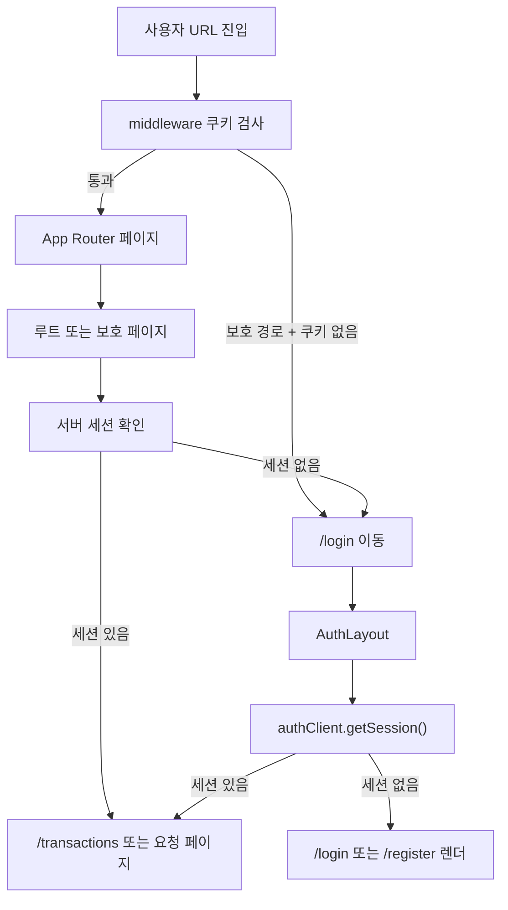
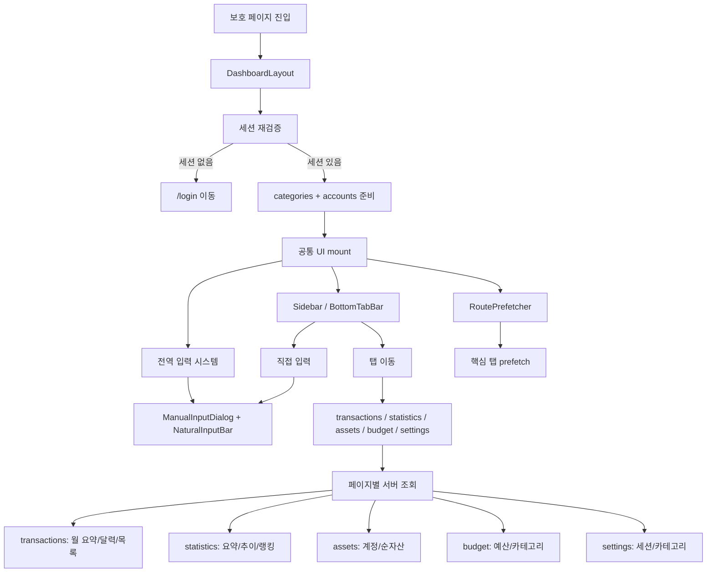
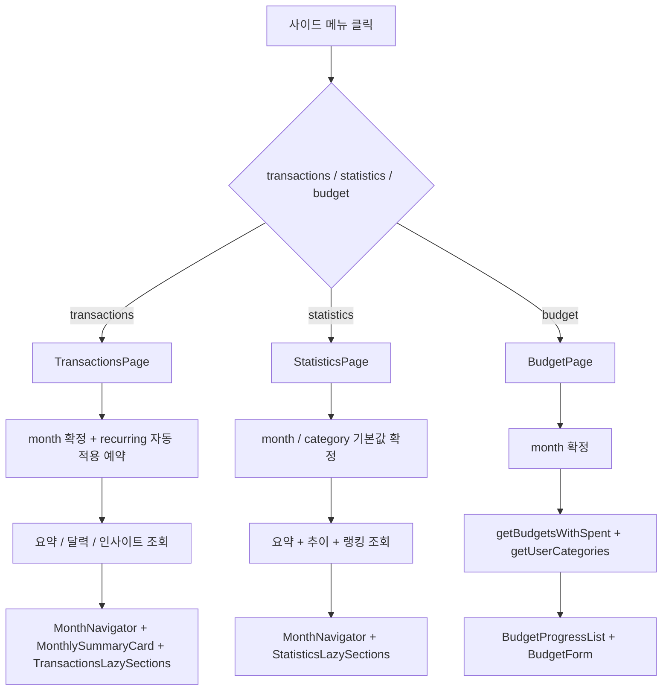
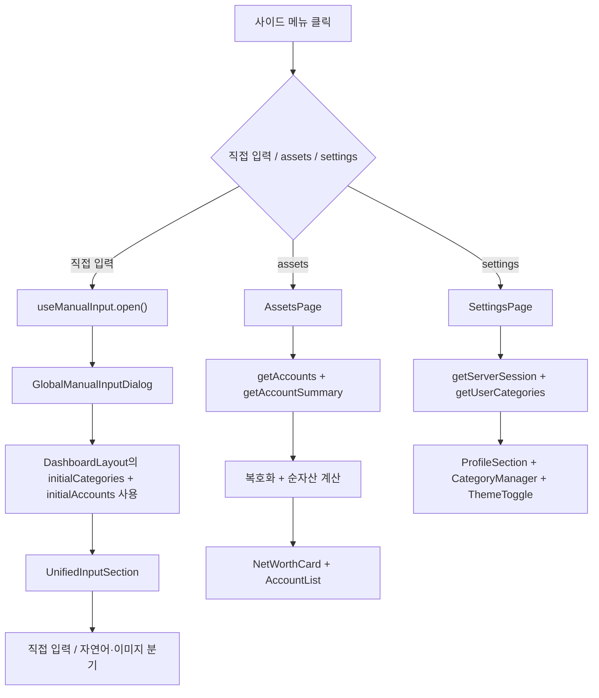

# 전체 네비게이션 개요

이 문서는 라우트 진입, 보호 경로 검사, 공통 레이아웃, 전역 입력 진입점을 중간 밀도 차트로 정리한다.

## 차트 1. 진입과 인증 게이트

## 차트 2. 대시보드 공통 쉘과 이동

## 차트 3. 거래·통계·예산 첫 접근

## 차트 4. 직접 입력·자산·설정 첫 접근

## 포함 액션

- 루트 진입;
- 보호 경로 접근;
- 로그인/회원가입 화면 우회;
- 사이드바/하단 탭 네비게이션;
- 사이드 메뉴 최초 진입;
- 전역 직접 입력 다이얼로그 열기;
- 각 대시보드 페이지의 서버 데이터 로드;

## 관련 코드

- `src/app/page.tsx`;
- `middleware.ts`;
- `src/app/(auth)/layout.tsx`;
- `src/app/(dashboard)/layout.tsx`;
- `src/components/layout/Sidebar.tsx`;
- `src/components/layout/BottomTabBar.tsx`;
- `src/components/layout/RoutePrefetcher.tsx`;
- `src/components/providers/ManualInputProvider.tsx`;
- `src/components/providers/GlobalManualInputDialog.tsx`;
- `src/components/transaction/UnifiedInputSection.tsx`;
