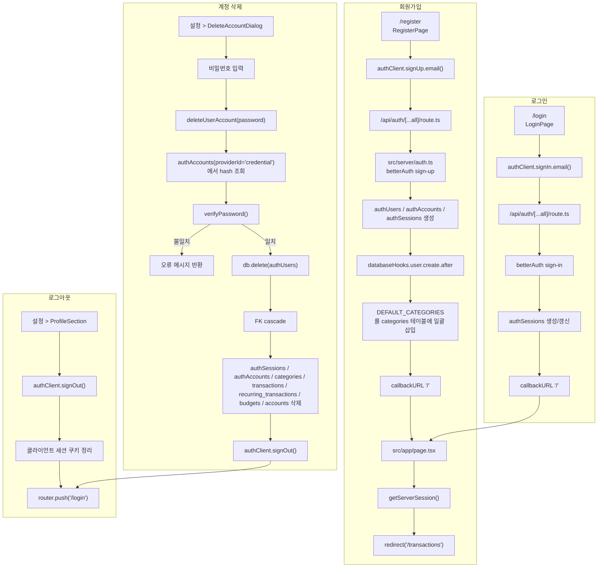

# 인증과 사용자 생명주기

이 문서는 회원가입, 로그인, 로그아웃, 계정 삭제 흐름과 데이터 삭제 범위를 정리한다.

## 보조 분기

- `middleware.ts`는 보호 경로에서 세션 쿠키만 빠르게 확인한다;
- `src/app/(dashboard)/layout.tsx`는 서버에서 `getServerSession()`으로 다시 검증한다;
- `src/app/(auth)/layout.tsx`는 이미 로그인한 사용자를 `/transactions`로 되돌린다;

## 관련 코드

- `src/app/(auth)/login/page.tsx`;
- `src/app/(auth)/register/page.tsx`;
- `src/app/(auth)/layout.tsx`;
- `src/app/api/auth/[...all]/route.ts`;
- `src/server/auth.ts`;
- `src/components/settings/ProfileSection.tsx`;
- `src/components/settings/DeleteAccountDialog.tsx`;
- `src/server/actions/settings.ts`;
- `src/server/db/schema.ts`;
