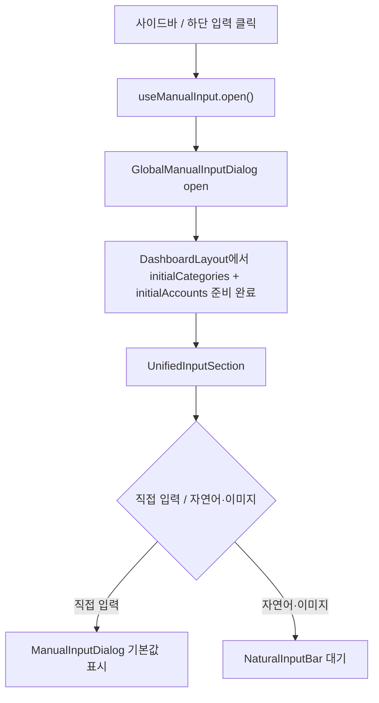
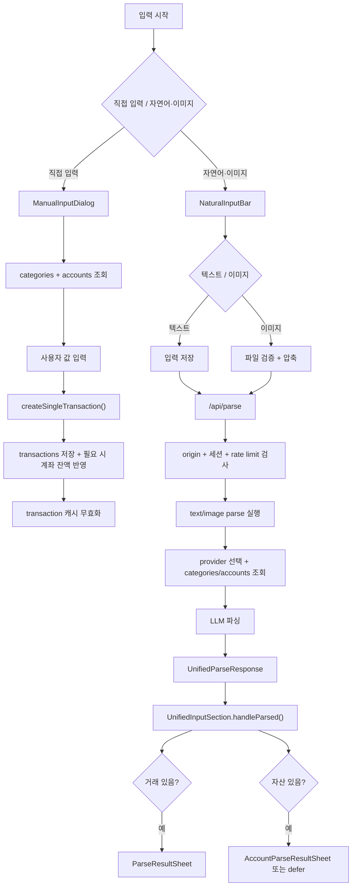
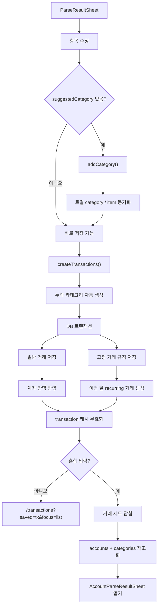

# 거래 입력과 파싱

이 문서는 수동 입력, 자연어/이미지 파싱, 파싱 결과 검수, 혼합 입력 분기를 중간 밀도 흐름으로 정리한다.

## 차트 1. 직접 입력 첫 접근

## 차트 2. 입력에서 결과 시트까지

## 차트 3. 파싱 결과 검수와 저장

## 관련 코드

- `src/app/(dashboard)/layout.tsx`;
- `src/components/providers/ManualInputProvider.tsx`;
- `src/components/providers/GlobalManualInputDialog.tsx`;
- `src/components/transaction/ManualInputDialog.tsx`;
- `src/components/transaction/NaturalInputBar.tsx`;
- `src/components/transaction/ParseResultSheet.tsx`;
- `src/components/transaction/UnifiedInputSection.tsx`;
- `src/app/api/parse/route.ts`;
- `src/server/services/parse-core.ts`;
- `src/server/actions/transaction.ts`;
- `src/server/actions/settings.ts`;
