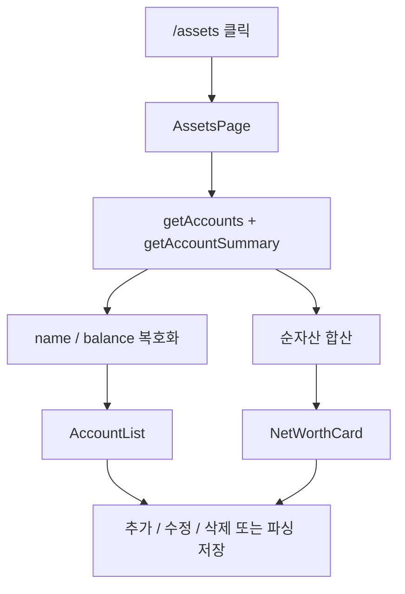
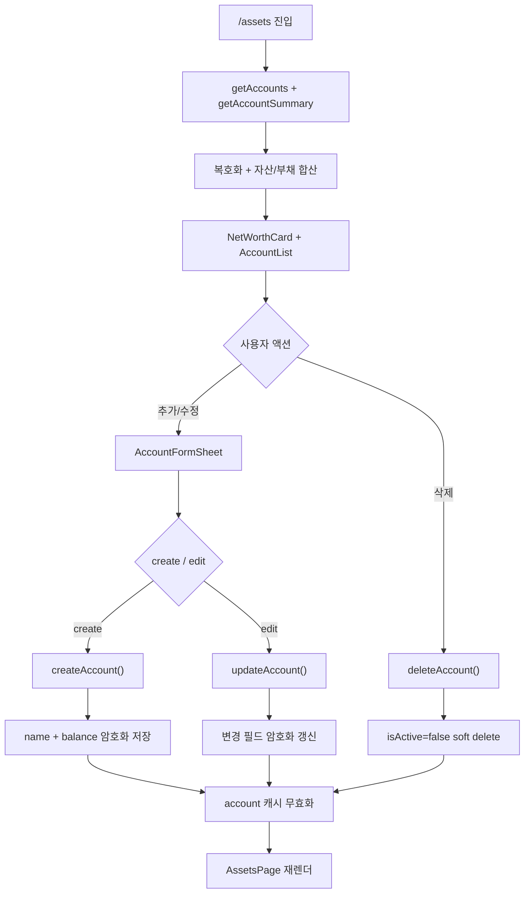
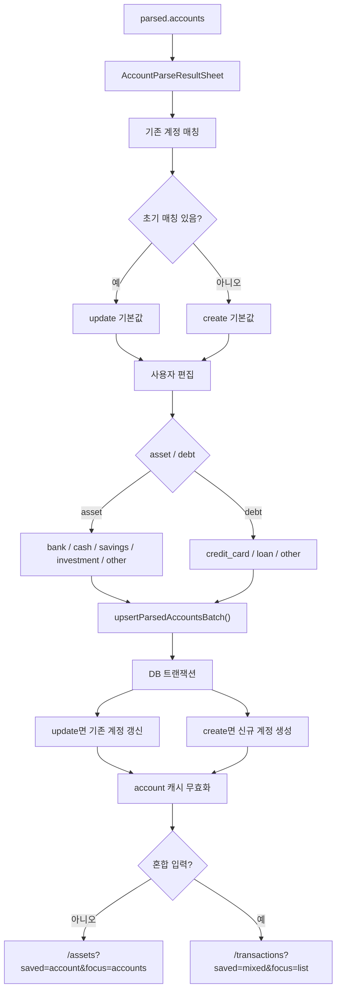

# 자산과 부채 플로우

이 문서는 자산/부채 조회, 수동 관리, 파싱 결과 저장을 중간 밀도 차트로 정리한다.

## 차트 1. 자산/부채 첫 접근

## 차트 2. 조회와 수동 관리

## 차트 3. 파싱 결과 저장

## 핵심 데이터 처리

- `accounts.name`, `accounts.balance`는 저장 시 암호화되고 조회 시 복호화된다;
- `getAccountSummary()`는 DB `SUM()` 대신 애플리케이션 레벨에서 복호화 후 합산한다;
- 삭제는 실제 row 삭제가 아니라 `isActive=false` 처리라 거래 이력의 `accountId` 참조를 보존한다;

## 관련 코드

- `src/app/(dashboard)/assets/page.tsx`;
- `src/components/assets/AccountList.tsx`;
- `src/components/assets/AccountFormSheet.tsx`;
- `src/components/assets/AccountParseResultSheet.tsx`;
- `src/components/assets/NetWorthCard.tsx`;
- `src/server/actions/account.ts`;
- `src/server/db/schema.ts`;
