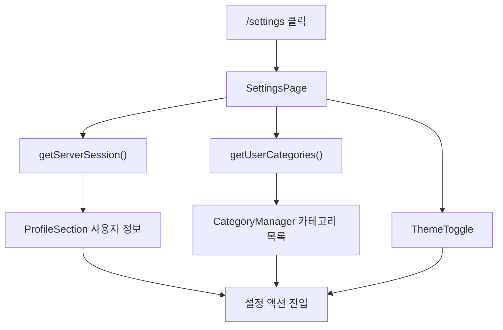
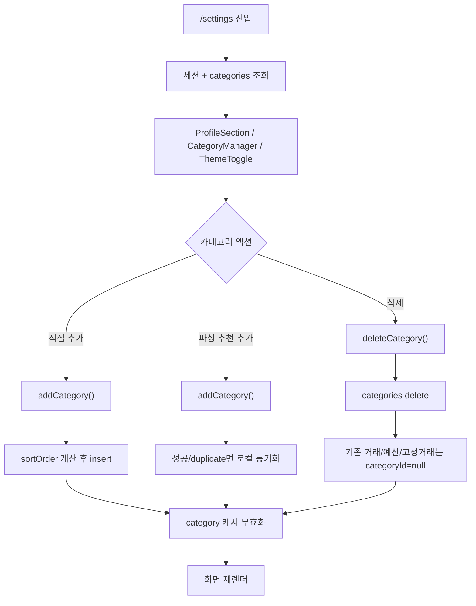
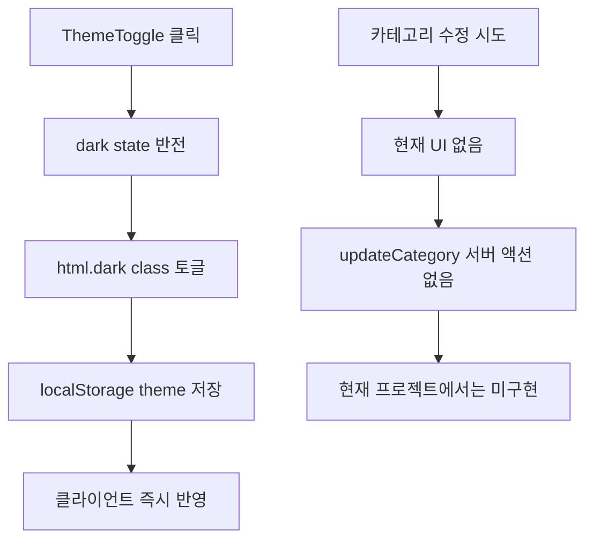

# 카테고리와 설정 플로우

이 문서는 설정 화면과 카테고리 수명주기를 중간 밀도 차트로 정리한다.

## 차트 1. 설정 첫 접근

## 차트 2. 설정 화면과 카테고리 수명주기

## 차트 3. 테마 토글과 카테고리 수정 부재

## 관련 코드

- `src/app/(dashboard)/settings/page.tsx`;
- `src/components/settings/CategoryManager.tsx`;
- `src/components/settings/ProfileSection.tsx`;
- `src/components/settings/ThemeToggle.tsx`;
- `src/server/actions/settings.ts`;
- `src/components/transaction/ParseResultSheet.tsx`;
- `src/server/db/schema.ts`;
