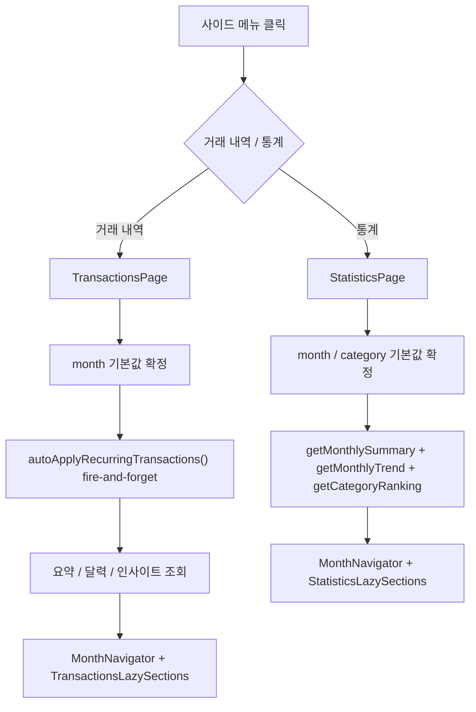
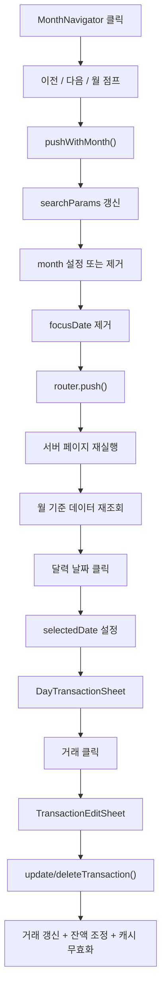
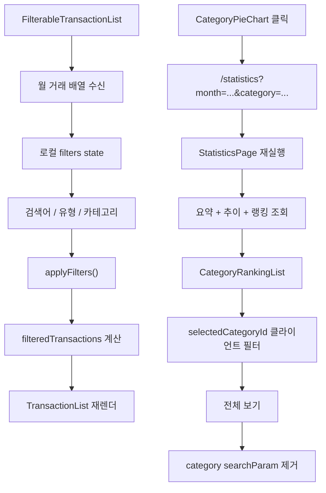

# 날짜 이동, 필터링, 통계 드릴다운

이 문서는 날짜 이동, 거래 필터링, 통계 드릴다운을 중간 밀도 차트로 정리한다.

## 차트 1. 거래 내역·통계 첫 접근

## 차트 2. 월 이동과 날짜 선택

## 차트 3. 거래 필터링과 통계 드릴다운

## 현재 구현 특징

- 거래내역 필터는 서버 재조회가 아니라, 이미 불러온 해당 월 거래 배열에 대한 클라이언트 필터다;
- 월 이동은 `searchParams` 기반이라 새 서버 렌더를 유도한다;
- 통계 카테고리 상세는 서버에서 월 데이터는 다시 받고, 선택 카테고리 좁히기는 클라이언트에서 수행한다;

## 관련 코드

- `src/components/dashboard/MonthNavigator.tsx`;
- `src/app/(dashboard)/transactions/page.tsx`;
- `src/app/(dashboard)/statistics/page.tsx`;
- `src/app/(dashboard)/budget/page.tsx`;
- `src/components/dashboard/InteractiveCalendar.tsx`;
- `src/components/dashboard/CalendarView.tsx`;
- `src/components/dashboard/DayTransactionSheet.tsx`;
- `src/components/transaction/FilterableTransactionList.tsx`;
- `src/components/transaction/TransactionList.tsx`;
- `src/components/dashboard/CategoryPieChart.tsx`;
- `src/components/statistics/CategoryRankingList.tsx`;
