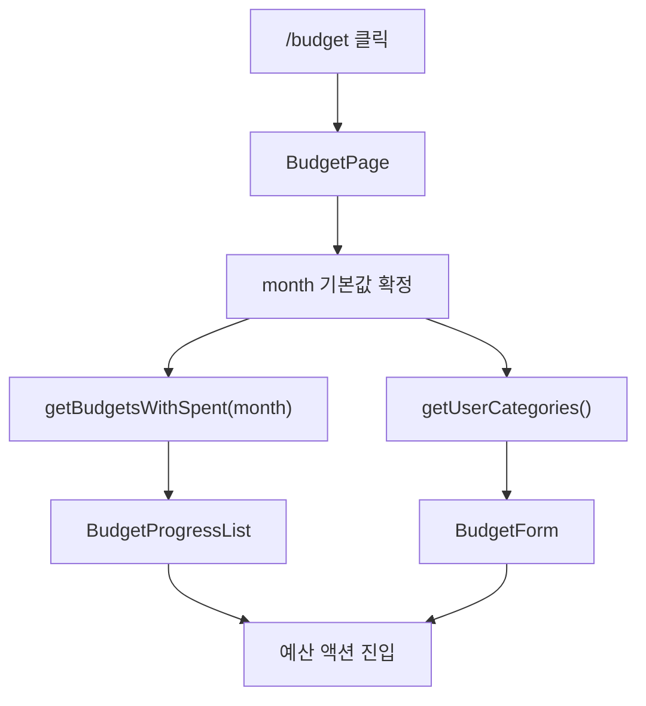
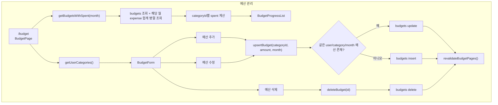
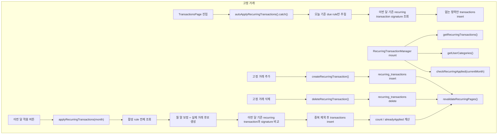

# 예산과 고정 거래 플로우

이 문서는 예산 CRUD와 고정 거래 규칙/적용 흐름을 정리한다.

## 차트 1. 예산 첫 접근

## 차트 2. 예산 관리

## 차트 3. 고정 거래

## 관련 코드

- `src/app/(dashboard)/budget/page.tsx`;
- `src/components/budget/BudgetForm.tsx`;
- `src/components/budget/BudgetProgressList.tsx`;
- `src/server/actions/budget.ts`;
- `src/components/transaction/RecurringTransactionManager.tsx`;
- `src/server/actions/recurring.ts`;
- `src/app/(dashboard)/transactions/page.tsx`;
