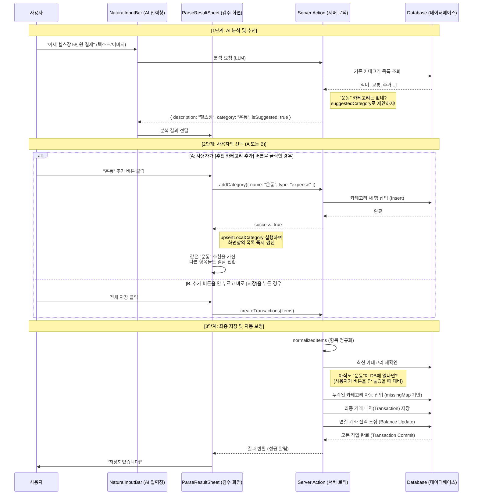

# 라이브 화면 면접 스크립트

> 프로젝트 화면을 띄워놓고 설명할 때 사용할 고정 동선이다.;

## 목적

면접관이 화면을 보여달라고 하거나, 코드를 열어 두고 구조를 설명해 보라고 할 때 **같은 순서로 말하기 위한 문서**다.  
즉흥적으로 이것저것 설명하지 않고, `화면 → 이벤트 → 서버 → 저장 → 갱신` 순서로 고정한다.;

## 60초 소개

> "이 프로젝트는 자연어로 입력하면 AI가 거래나 자산/부채를 자동 분류하는 가계부입니다. 제가 풀고 싶었던 문제는 기존 가계부의 입력 마찰이 너무 크다는 점이었고, 그래서 한 줄 입력과 확인 시트 중심으로 UX를 설계했습니다. 구조적으로는 Next.js App Router의 Server Component와 Server Actions를 기본으로 쓰고, 파싱처럼 취소·이미지 업로드가 필요한 부분만 `/api/parse`로 분리했습니다. 면접에서는 메인 거래 화면 기준으로 입력부터 저장, 그리고 저장 후 화면 갱신까지의 흐름을 설명드릴 수 있습니다.";

## 화면 설명 순서

### 1. 홈 진입

- 기준 파일: [page.tsx](/Users/leeth/Documents/git/Household account book/src/app/page.tsx);
- 포인트: 로그인 상태면 `/transactions`, 아니면 `/login`으로 리다이렉트;
- 한 문장:
    > "루트는 비즈니스 로직이 아니라 인증 분기만 담당합니다.";

### 2. 대시보드 공통 레이아웃

- 기준 파일: [layout.tsx](/Users/leeth/Documents/git/Household account book/src/app/(dashboard)/layout.tsx);
- 포인트:
    - 서버에서 세션 확인;
    - 초기 카테고리/계좌를 병렬 조회;
    - `Sidebar`, `BottomTabBar`, `UnifiedInputSection`을 공통으로 배치;
- 한 문장:
    > "레이아웃 단계에서 공통 데이터와 입력 진입점을 준비해 두고, 페이지는 읽기 전용 서버 렌더에 집중하게 했습니다.";

### 3. 거래 화면

- 기준 파일: [page.tsx](/Users/leeth/Documents/git/Household account book/src/app/(dashboard)/transactions/page.tsx);
- 포인트:
    - `Suspense`로 월 네비게이터, 요약, 캘린더, 인사이트를 분리;
    - `cache()`로 같은 요청 내 중복 조회를 줄임;
    - `autoApplyRecurringTransactions()`를 fire-and-forget으로 호출;
- 한 문장:
    > "거래 화면은 한 번에 모든 걸 기다리지 않고, 섹션 단위 로딩과 서버 조회 분리로 체감 속도를 높였습니다.";

### 4. 자연어 입력

- 기준 파일: [UnifiedInputSection.tsx](/Users/leeth/Documents/git/Household account book/src/components/transaction/UnifiedInputSection.tsx);
- 이어서 볼 파일: [NaturalInputBar.tsx](/Users/leeth/Documents/git/Household account book/src/components/transaction/NaturalInputBar.tsx);
- 포인트:
    - 입력바는 클라이언트 컴포넌트;
    - 이미지 선택 시 클라이언트 압축;
    - `/api/parse`로 요청;
    - 결과에 따라 거래 시트, 자산 시트를 분기;
- 한 문장:
    > "브라우저에서 해야 하는 일은 입력, 미리보기, 취소, 시트 분기까지고, 파싱 판단 자체는 서버에서 합니다.";

### 5. `/api/parse`와 파서 오케스트레이션

- 기준 파일: [route.ts](/Users/leeth/Documents/git/Household account book/src/app/api/parse/route.ts);
- 이어서 볼 파일: [parse-core.ts](/Users/leeth/Documents/git/Household account book/src/server/services/parse-core.ts);
- 포인트:
    - 세션 확인;
    - 텍스트/이미지 분기;
    - OOD 필터;
    - provider 선택;
    - 카테고리/계좌 병렬 조회;
    - Fireworks 실패 시 Kimi 폴백 가능;
- 한 문장:
    > "이 파일의 역할은 파싱 로직 자체가 아니라, 인증과 입력 타입을 정리해서 공용 서비스로 넘기는 얇은 엔트리포인트입니다.";

### 6. LLM 응답 검증

- 기준 파일: [index.ts](/Users/leeth/Documents/git/Household account book/src/server/llm/index.ts);
- 포인트:
    - `extractJSON()`으로 코드블록 제거;
    - `parseUnifiedResponse()`에서 거래/자산 응답 검증;
    - `rejected: true`면 저장 이전에 차단;
- 한 문장:
    > "AI 응답을 그대로 믿지 않고, 구조화·검증·거부 단계를 둔 것이 핵심 안전장치입니다.";

### 7. 저장과 갱신

- 기준 파일: [ParseResultSheet.tsx](/Users/leeth/Documents/git/Household account book/src/components/transaction/ParseResultSheet.tsx);
- 이어서 볼 파일: [transaction.ts](/Users/leeth/Documents/git/Household account book/src/server/actions/transaction.ts);
- 이어서 볼 파일: [cache-keys.ts](/Users/leeth/Documents/git/Household account book/src/lib/cache-keys.ts);
- 포인트:
    - 사용자가 시트에서 수정 후 저장;
    - Server Action이 DB에 저장;
    - `revalidateTransactionPages()`로 거래/통계/자산/예산 관련 경로 무효화;
- 한 문장:
    > "이 프로젝트는 클라이언트 store 갱신보다 서버 저장 후 재렌더를 기본 전략으로 택했습니다.";

### 8. 자산 화면

- 기준 파일: [page.tsx](/Users/leeth/Documents/git/Household account book/src/app/(dashboard)/assets/page.tsx);
- 이어서 볼 파일: [account.ts](/Users/leeth/Documents/git/Household account book/src/server/actions/account.ts);
- 포인트:
    - `accounts`는 자산과 부채를 같은 축에서 관리;
    - `getAccountSummary()`는 암호화된 balance를 앱 레벨에서 복호화 후 합산;
- 한 문장:
    > "자산/부채를 나눠 숨기지 않고 순자산 관점으로 묶은 것이 사용자 이해에 더 유리하다고 판단했습니다.";

### 9. 설정 화면

- 기준 파일: [page.tsx](/Users/leeth/Documents/git/Household account book/src/app/(dashboard)/settings/page.tsx);
- 포인트:
    - 카테고리 관리;
    - 다크모드;
    - 계정 삭제;
- 한 문장:
    > "설정은 단순 꾸미기보다, 데이터 구조와 접근 정책을 바꾸는 운영 화면으로 봤습니다.";

## 3분 구조 설명 스크립트

> "구조는 크게 읽기와 쓰기로 나눴습니다. 읽기 쪽은 Next.js Server Component가 담당해서, 대시보드 레이아웃과 거래 페이지가 세션 확인과 초기 데이터 조회를 서버에서 처리합니다. 쓰기 쪽은 대부분 Server Action으로 묶었고, 저장이 끝나면 `revalidatePath` 래퍼를 통해 관련 화면을 다시 렌더합니다. 예외적으로 자연어 파싱은 취소, 이미지 payload, HTTP 상태 제어가 필요해서 `/api/parse`를 남겼고, 그 안에서 `parse-core`가 OOD 필터, provider 선택, 사용자 카테고리/계좌 조회, LLM 호출까지 오케스트레이션합니다. 마지막으로 AI 응답은 바로 저장하지 않고 ParseResultSheet에서 수정/확인 단계를 거치게 해서, 자동화와 신뢰 사이의 균형을 잡았습니다.";

## 꼭 대비할 꼬리 질문 5개

### 1. 왜 전역 상태 라이브러리를 안 썼나

> "읽기는 서버에서 다시 하고, 쓰기는 Server Action 뒤 `revalidatePath`로 갱신하기 때문에 전역 store 필요성이 낮았습니다. 전역 공유가 필요한 상태는 수동 입력 다이얼로그 정도여서 Context 하나로 충분했습니다.";

### 2. 왜 API Route와 Server Actions를 같이 쓰나

> "일반 CRUD는 Server Action이 더 단순하고 타입 연결이 좋습니다. 반면 파싱은 이미지 업로드, 요청 취소, HTTP status 제어가 필요해서 `/api/parse`가 더 맞았습니다.";

### 3. 바이브 코딩했는데 직접 이해한 부분이 뭔가

> "초안 생성과 탐색에는 AI를 썼지만, 지금 설명드리는 데이터 흐름, 파서 오케스트레이션, 캐시 무효화, UX 안전장치는 제가 구조를 이해하고 정리한 부분입니다. 특히 어떤 로직을 서버에 두고 어떤 로직을 브라우저에 둘지, 저장 후 어떤 화면을 같이 갱신할지는 직접 결정했습니다.";

### 4. 현재 가장 약한 부분은 뭔가

> "테스트가 적고, Fireworks 사용량 상태가 인메모리라는 점입니다. 그래서 회귀 방어와 멀티 인스턴스 안정성은 다음 보강 포인트로 보고 있습니다.";

### 5. pxd와 왜 맞는가

> "이 프로젝트에서 제가 가장 신경 쓴 건 화면을 예쁘게 만드는 것보다, 입력 마찰을 줄이는 구조와 검증 가능한 UX를 만드는 것이었습니다. 사용자가 어떤 순간에 불편한지 정의하고, 그걸 자연어 입력, 확인 시트, 실패 방어 로직으로 풀어낸 점이 pxd의 문제 해결형 UX 개발 방식과 맞닿아 있다고 생각합니다.";

## pxd 답변 프레임

아래 4문장 구조를 반복한다.;

1. 문제 정의;
2. 왜 이 구조를 택했는지;
3. 현재 한계;
4. 다음 개선;

예시:;

> "가계부의 핵심 문제는 입력 마찰이 높다는 점이었습니다. 그래서 자연어 입력과 확인 시트를 중심으로, 사용자가 빠르게 입력하되 마지막 검증은 직접 할 수 있는 구조를 택했습니다. 현재 한계는 테스트가 부족하고 provider 상태가 인메모리라는 점입니다. 다음 단계에서는 E2E와 외부 상태 저장으로 안정성을 먼저 보강하려고 합니다.";

