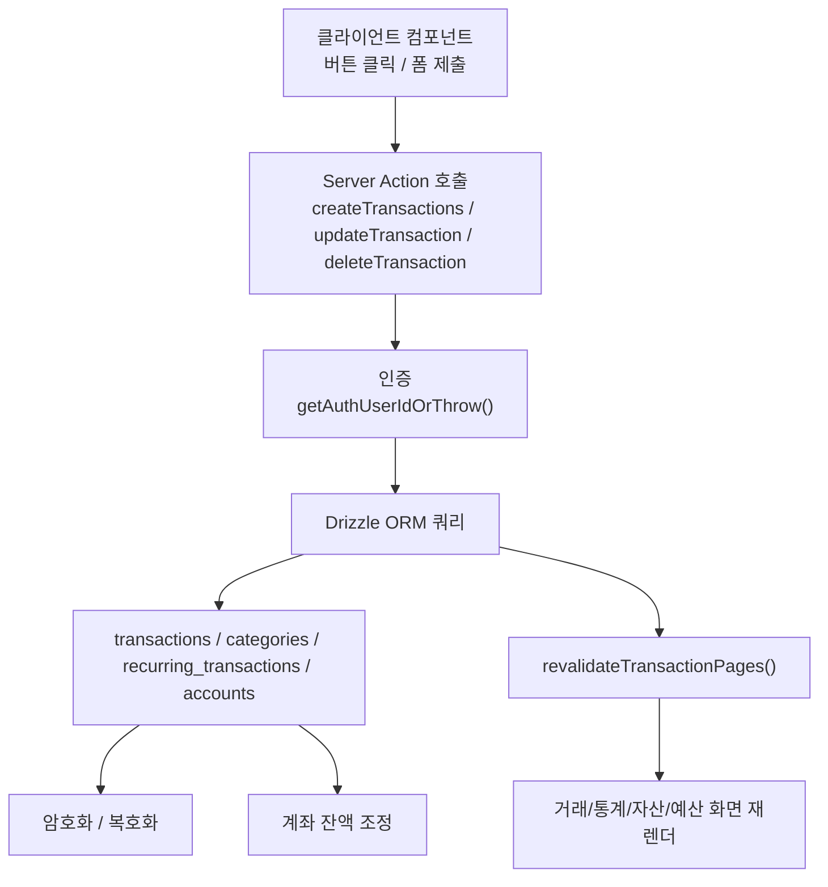
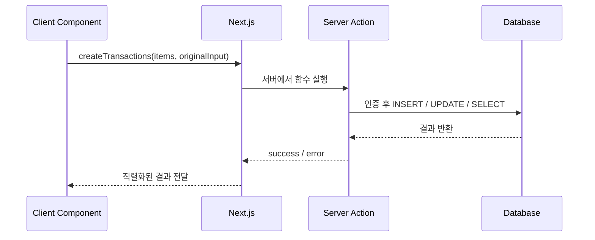
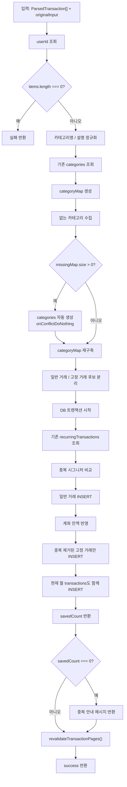
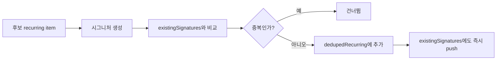
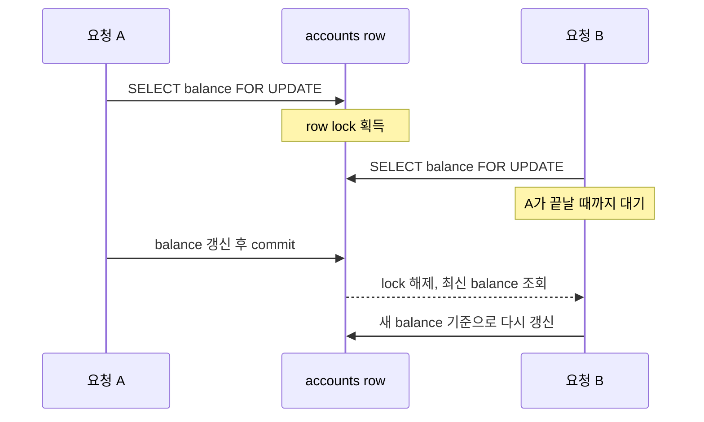
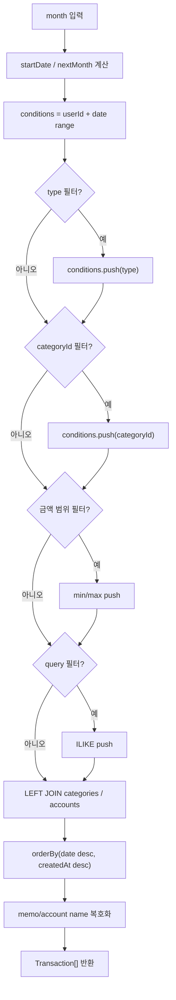
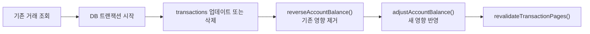

# 3-5. `transaction.ts` 해부

> 이 파일 하나가 거래 저장, 조회, 수정, 삭제, 통계 집계를 거의 다 담당한다. React 문법보다 중요한 것은 "서버 액션이 DB 일관성을 어떻게 지키는가"다.;

## 한 문장 요약

`src/server/actions/transaction.ts`는 "거래 CRUD + 계좌 잔액 반영 + 월별 조회/집계 + 캐시 무효화"를 한곳에서 묶은 서버 액션 모듈이다.;

## 먼저 큰 그림

이 파일을 읽을 때는 함수들을 하나씩 외우기보다 아래 4개 그룹으로 나누면 된다.;

| 그룹 | 함수 | 핵심 역할 |
|---|---|---|
| 잔액 조정 헬퍼 | `adjustAccountBalance`, `reverseAccountBalance` | 계좌 잔액을 증감하고 동시성 충돌을 막는다; |
| 저장 계열 | `createTransactions`, `createSingleTransaction` | 거래 INSERT와 잔액 반영을 묶는다; |
| 변경 계열 | `updateTransaction`, `deleteTransaction` | 기존 거래를 되돌린 뒤 새 상태를 반영한다; |
| 조회/집계 계열 | `getTransactions`, `getMonthlySummary`, `getCategoryBreakdown`, `getDailyExpenses`, `getMonthlyCalendarData`, `getUserCategories` | 화면 렌더에 필요한 리스트와 통계를 만든다; |

## 왜 `"use server"`가 중요한가

이 파일의 export 함수는 브라우저에서 직접 실행되지 않는다. 클라이언트가 호출하더라도 실제 실행은 서버에서 일어난다.;

그래서 DB 자격 증명, 암호화 키, 민감한 쿼리 로직이 브라우저로 노출되지 않는다.;

## 1. `createTransactions()`가 진짜 핵심인 이유

이 함수는 AI 파싱 결과 여러 건을 한 번에 저장한다. 단순한 `insert`가 아니라 다음 문제를 한 번에 해결한다.;

- 카테고리 이름이 들쑥날쑥한 문제;
- 추천 카테고리가 아직 DB에 없는 문제;
- 고정 거래 중복 생성 문제;
- 거래 저장과 잔액 반영이 따로 놀면 안 되는 문제;
- 저장 직후 화면 캐시를 비워야 하는 문제;

### 저장 흐름 전체

### 코드 읽기 포인트

#### 1) 정규화는 "사람이 보기 좋게"보다 "중복을 줄이기 위해" 존재한다

`normalizeCategoryName()`은 `" 식 비 "`와 `"식비"`를 같은 값으로 맞춘다. 여기서 흔히 놓치는 포인트는 UI 포맷팅이 아니라 DB 정합성이다.;

#### 2) 없는 카테고리를 자동 생성해서 저장 플로우를 끊지 않는다

AI가 `"구독"` 카테고리를 추천했는데 사용자의 카테고리 테이블에 없을 수 있다. 이때 저장을 막지 않고 먼저 `categories`에 넣고 다시 맵을 만들어 `categoryId`를 연결한다.;

#### 3) 고정 거래는 테이블이 2개다

고정 거래 후보는 최종적으로 아래 두 군데에 들어간다.;

- `recurring_transactions`: 다음 달에도 반복 생성할 규칙 저장;
- `transactions`: 이번 달 화면에 바로 보일 실제 거래 저장;

이중 저장이 어색해 보여도, "반복 규칙"과 "이번 달 실거래"는 성격이 다르기 때문에 둘 다 필요하다.;

#### 4) 중복 판정은 트랜잭션 안에서 한다

고정 거래 중복 비교는 `type`, `amount`, `description`, `categoryId`, `dayOfMonth`를 기준으로 한다. 특히 `dayOfMonth`는 `±1일` 허용이라, 날짜가 하루 정도 흔들려도 같은 반복 거래로 본다.;

이 `push`가 중요한 이유는 "같은 요청 안에서 같은 고정 거래가 두 번 들어온 경우"까지 막기 위해서다.;

## 2. 잔액 조정은 왜 별도 헬퍼로 분리됐나

`adjustAccountBalance()`와 `reverseAccountBalance()`는 거래 테이블과 계좌 테이블이 불일치하지 않게 만드는 안전장치다.;

### 잔액 반영 규칙

| 상황 | type | balance 변화 |
|---|---|---|
| 새 거래 저장 | `income` | `+amount`; |
| 새 거래 저장 | `expense` | `-amount`; |
| 거래 삭제/수정 전 되돌리기 | `income` | `-amount`; |
| 거래 삭제/수정 전 되돌리기 | `expense` | `+amount`; |

### 왜 `FOR UPDATE`가 필요한가

락이 없으면 두 요청이 같은 잔액 10000원을 동시에 읽고 각각 계산해 마지막 저장이 앞선 계산을 덮어쓸 수 있다. 이 파일은 그 문제를 피하려고 `SELECT ... FOR UPDATE`를 raw SQL로 직접 사용한다.;

## 3. 조회 함수는 "조건 배열을 쌓고 마지막에 합치는 패턴"으로 읽으면 된다

`getTransactions()`는 필터가 있을 때만 조건을 추가한다.;

여기서 핵심은 `conditions: SQL[]` 배열이다. 조건을 하나씩 누적해 두고 마지막에 `where(and(...conditions))`로 합친다. React 쪽 분기처럼 `if`를 여러 번 쓰되, 실제 SQL은 최종 시점에 한 번만 조립된다.;

### 왜 `LEFT JOIN`을 쓰나

거래는 남기되 카테고리나 계좌 연결이 없을 수 있기 때문이다. `INNER JOIN`이었다면 `categoryId`가 `null`인 거래가 통째로 사라질 수 있다.;

### 왜 `originalInput`은 항상 `null`로 돌려주나

리스트 화면에서는 원문이 필요 없고, 암호화된 원문을 전부 복호화하면 건수에 비례해 비용이 커진다. 즉, 이 함수는 단순 조회 함수가 아니라 "리스트 화면에 맞춘 최적화된 조회"다.;

## 4. 수정과 삭제는 "기존 상태를 먼저 되돌린다"가 핵심이다

처음 보면 `updateTransaction()`이 왜 잔액 반영을 두 번 하는지 헷갈리기 쉽다. 순서는 아래처럼 읽으면 된다.;

### 세 함수 차이

| 함수 | 하는 일 | 잔액 처리 |
|---|---|---|
| `createSingleTransaction()` | 수동 거래 1건 추가; | 새 거래 기준으로 한 번 반영; |
| `deleteTransaction()` | 기존 거래 삭제; | 기존 거래 영향만 역산; |
| `updateTransaction()` | 일부 필드만 수정 가능; | 기존 영향 역산 후 새 값으로 다시 반영; |

`updateTransaction()`은 특히 "계좌가 바뀌는 경우"까지 처리해야 해서, 기존 거래를 먼저 읽고 `existing.accountId`, `existing.type`, `existing.amount`를 보관해 둔다.;

## 5. 집계 함수는 화면별 맞춤 SQL이다

이 파일의 후반부 함수들은 전부 같은 패턴을 반복한다.;

| 함수 | 반환 대상 | SQL 패턴 |
|---|---|---|
| `getMonthlySummary()` | 월 수입/지출/잔액 카드; | `sum(amount)`를 `type`별로 그룹화; |
| `getCategoryBreakdown()` | 도넛 차트 데이터; | `expense`만 필터 후 카테고리별 그룹화; |
| `getDailyExpenses()` | 최근 7일 바 차트; | 날짜별 지출 합계; |
| `getMonthlyCalendarData()` | 달력 셀 표시값; | 날짜 + 타입 기준 그룹화 후 객체로 재구성; |
| `getUserCategories()` | 필터/폼 선택지; | 정렬된 카테고리 목록 조회; |

즉, 이 파일은 "서버 액션 모듈"이면서 동시에 "거래 화면용 쿼리 집합"이다.;

## 6. 이 파일을 읽을 때 꼭 잡아야 하는 설계 포인트

### 포인트 1. 거래 저장과 잔액 변경은 하나의 트랜잭션이다

둘 중 하나라도 실패하면 전체 롤백돼야 한다. 이 원칙이 이 파일 전반을 관통한다.;

### 포인트 2. 암호화는 저장/조회 경계에 붙어 있다

`memo`, `originalInput`, 계좌 이름/잔액 같은 민감값은 DB 저장 시 암호화되고, 화면 반환 직전에만 복호화된다.;

### 포인트 3. 재검증은 액션 마지막에 한 번만 한다

`revalidateTransactionPages()`가 공통 후처리처럼 붙어 있는 이유는 "거래 변경이 여러 화면에 동시에 영향을 준다"는 도메인 특성 때문이다.;

### 포인트 4. 조회 함수는 도메인별 View Model을 만든다

DB row를 그대로 내보내지 않고 `Transaction`, `MonthlySummary`, `CategoryBreakdown` 같은 화면 친화적 타입으로 다시 만든다.;

## 30초 요약

> "`transaction.ts`는 단순 CRUD 파일이 아니라, 거래 저장과 계좌 잔액을 일관되게 묶고, 고정 거래 중복을 막고, 암호화와 캐시 무효화까지 담당하는 서버 액션 허브입니다. 읽을 때는 저장 흐름, 잔액 조정, 조회 조합, 집계 SQL 네 묶음으로 나누면 훨씬 빨리 이해됩니다.";
